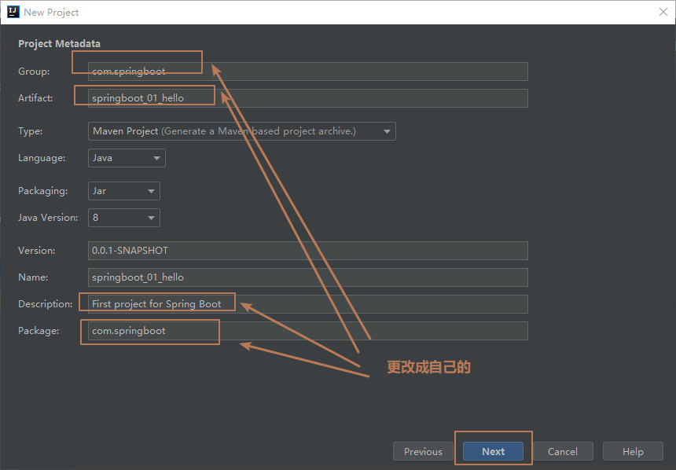
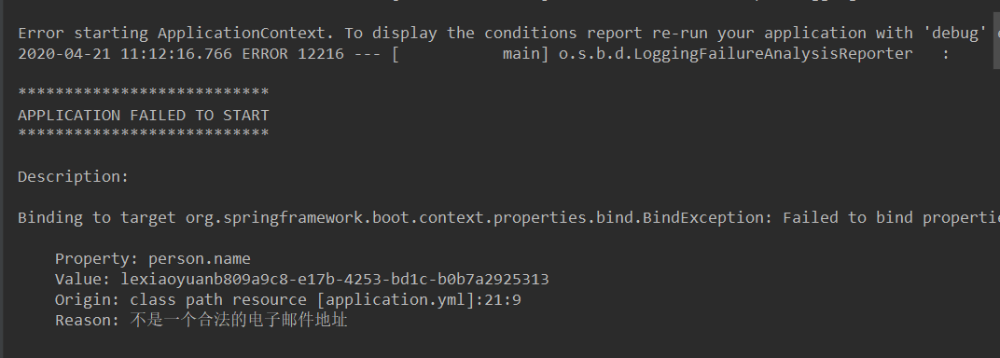
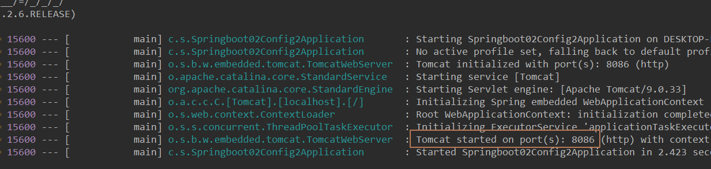
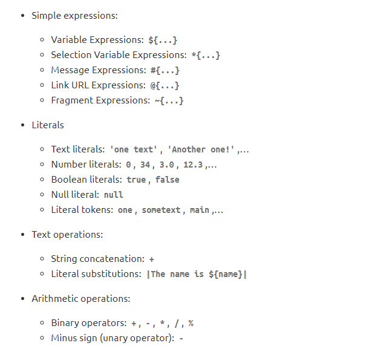
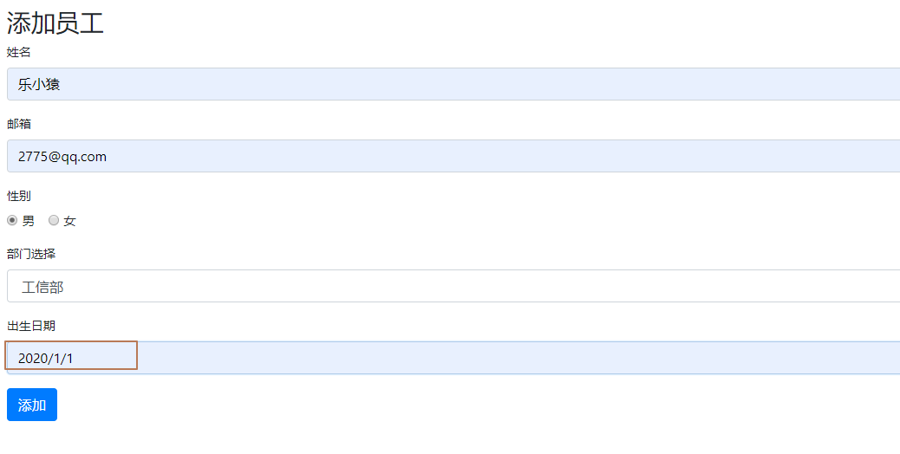
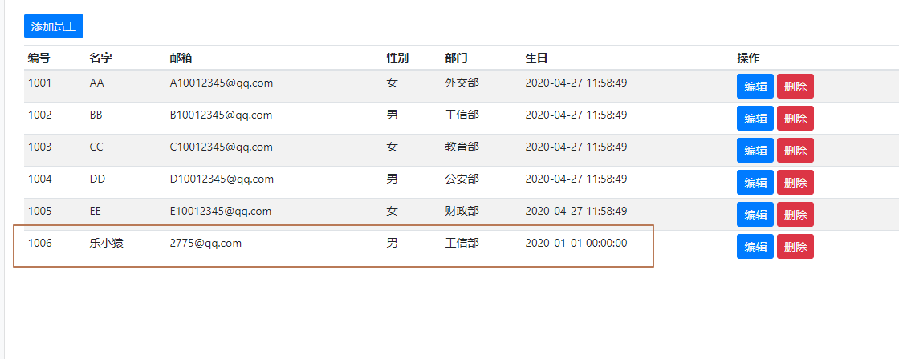
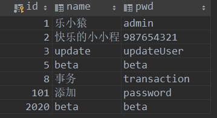
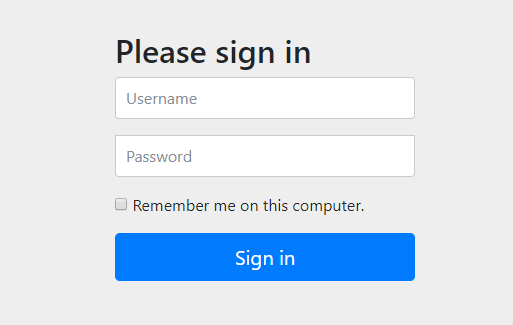
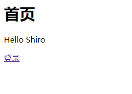

Spring Boot学习

> 官网：[https://spring.io/projects/spring-boot#overview](https://spring.io/projects/spring-boot#overview)
>
> 文档：[https://docs.spring.io/spring-boot/docs/2.2.6.RELEASE/reference/html/](https://docs.spring.io/spring-boot/docs/2.2.6.RELEASE/reference/html/)

[TOC]


## 第一个Spring Boot 程序

### 方式一：在线生成后导入

- 打开网站：[https://start.spring.io/](https://start.spring.io/)

- 按下图填写信息（基本上是保持默认）


- 点击生成后会提示下载，选择下载位置后，点击保存即可下载


- 下载完成后解压到当前目录
- 打开IDEA，导入解压后的文件，然后等待一段时间自动下载一些依赖


- 点击ok后，按下图进行勾选


- 完成后，可以看到默认的项目目录结构


- 可以删掉下图红框选中的几个，目录可以看得更清楚


- 点击下图的运行按钮即可启动项目


- 控制台会输出下图


- 在浏览器中输入：localhost:8080,回车，即可看到下图，表示项目启动成功。（只是现在还没有写任何代码，默认显示error页面。）


### 分析一下项目目录

- 通过上面步骤完成了基础项目的创建。就会自动生成以下文件。
  - 程序的主启动类：`Springboot01HelloApplication.java`
  - 一个 `application.properties` 配置文件：SpringBoot的核心配置文件

  - 一个 测试类：`Springboot01HelloApplicationTests.java`
  - 一个 `pom.xml`

- 看一下pom.xml中默认生成的依赖

```xml
<?xml version="1.0" encoding="UTF-8"?>
<project xmlns="http://maven.apache.org/POM/4.0.0" xmlns:xsi="http://www.w3.org/2001/XMLSchema-instance"
   xsi:schemaLocation="http://maven.apache.org/POM/4.0.0 https://maven.apache.org/xsd/maven-4.0.0.xsd">
   <modelVersion>4.0.0</modelVersion>
   <!--父依赖-->
   <parent>
      <groupId>org.springframework.boot</groupId>
      <artifactId>spring-boot-starter-parent</artifactId>
      <version>2.2.6.RELEASE</version>
      <relativePath/> <!-- lookup parent from repository -->
   </parent>
   <groupId>com.springboot</groupId>
   <artifactId>springboot_01_hello</artifactId>
   <version>0.0.1-SNAPSHOT</version>
   <name>springboot_01_hello</name>
   <description>Demo project for Spring Boot</description>

   <properties>
      <java.version>1.8</java.version>
   </properties>

   <dependencies>
        <!--web依赖-->
      <dependency>
         <groupId>org.springframework.boot</groupId>
         <artifactId>spring-boot-starter-web</artifactId>
      </dependency>

        <!--单元测试-->
      <dependency>
         <groupId>org.springframework.boot</groupId>
         <artifactId>spring-boot-starter-test</artifactId>
         <scope>test</scope>
         <exclusions>
            <exclusion>
               <groupId>org.junit.vintage</groupId>
               <artifactId>junit-vintage-engine</artifactId>
            </exclusion>
         </exclusions>
      </dependency>
   </dependencies>

    <!--打包(jar包)插件-->
   <build>
      <plugins>
         <plugin>
            <groupId>org.springframework.boot</groupId>
            <artifactId>spring-boot-maven-plugin</artifactId>
         </plugin>
      </plugins>
   </build>

</project>
```

### 添加自己的代码

> **再建包时必须要与程序的主启动类`Springboot01HelloApplication.java`的在同一级目录**
>
> 

- 在controller包下新建一个`HelloController.java`，代码如下：

```java
@RestController
public class HelloController {

    @GetMapping("/hello")
    public String hello(){
        return "Hello World!";
    }
}
```

- 再点击运行按钮


- 打开浏览器，访问：[http://localhost:8080/hello](http://localhost:8080/hello)，显示：


- 成功了！完成！

### 打包项目为jar包

- 打开侧边的Maven，双击package。


- maven环境没有错的话会显示BUILD SUCCESS，构建成功。


- 在项目的target目录下可以看到


- 在项目的target目录的位置打开命令行工具（按住shift键，再点击鼠标右键）


- 输入命令：`java -jar .\springboot_01_hello-0.0.1-SNAPSHOT.jar`（输入`java -jar spri`后按tab键会自动补全），回车。


- jar包运行成功，在浏览器输入：[http://localhost:8080/hello](http://localhost:8080/hello)，效果一样。

### 方式二：通过IDEA新建

- 打开idea，新建工程


- 选择Spring Initializr，点击next。


- 按下图操作，更改一些默认内容



- 添加web依赖


- 点击Finnish，完成！


- 剩下写代码跟方式一中的[添加自己的代码](###添加自己的代码)就是一样的了。
- 在`Springboot01Hello2Application.java`同级目录新建controller包，controller包下新建`HelloController.java`

```java
@RestController
public class HelloController {
    @GetMapping("/hello")
    public String hello(){
        return "Hello Spring Boot";
    }
}
```

### 更改访问端口

- 在`application.properties`中添加：

```properties
# 更改默认端口
server.port=8081
```

- 重新运行，访问：[http://localhost:8081/hello](http://localhost:8081/hello)


### 更改启动的banner

- 在网站[https://www.bootschool.net/ascii](https://www.bootschool.net/ascii)中在线生成banner文件


- 在resources目录下新建`banner.txt`文件，将上一步拷贝的结果粘贴进去。


- 再次运行，就可以看到新的banner


## 原理初探

### pom.xml中的自动配置

### 1. 父工程

- 核心依赖都在父工程`spring-boot-dependencies`中。
- 我们在引入一些Spring Boot依赖时，不需要指定版本，在父工程中已经有这些版本仓库。

### 2. 启动器

```xml
<dependency>
    <groupId>org.springframework.boot</groupId>
    <artifactId>spring-boot-starter</artifactId>
</dependency>
```

>  启动器：就是Spring Boot的启动场景，比如，定义了`spring-boot-starter-web`，就会自动导入Web环境所有的依赖。Spring Boot会将所有的功能场景，都变成一个个的启动器。我们要使用什么功能，就只需要找到对应的启动器就可以了。
>
> 官网文档：[https://docs.spring.io/spring-boot/docs/2.2.6.RELEASE/reference/html/using-spring-boot.html#using-boot-starter](https://docs.spring.io/spring-boot/docs/2.2.6.RELEASE/reference/html/using-spring-boot.html#using-boot-starter)

### 3. 主程序

- 注解【自动装配的核心】：
  - @SpringBootApplication：标注这个类是一个Spring Boot的应用，会导入启动类需要的所有资源
  - @SpringBootConfiguration——@Configuration——@Component
  - @ComponentScan：扫描当前主启动类同级的包
  - @EnableAutoConfiguration：自动导入包
    - @AutoConfigurationPackage——@Import({Registrar.class})：自动注册包
    - @Import({AutoConfigurationImportSelector.class})：自动导入包的核心

- 自动配置分析：https://www.processon.com/mindmap/5e527f11e4b02bc3ad5cdb95


### 4. 结论

>  自动配置真正实现是从classpath中搜寻所有的`META-INF/spring.factories`配置文件 ，并将其中对应的 org.springframework.boot.autoconfigure. 包下的配置项，通过反射实例化为对应标注了 @Configuration的JavaConfig形式的IOC容器配置类 ， 然后将这些都汇总成为一个实例并加载到IOC容器中。

`META-INF/spring.factories`的位置：


> 1. SpringBoot在启动的时候从类路径下的META-INF/spring.factories中获取EnableAutoConfiguration指定的值
> 2. 将这些值作为自动配置类导入容器 ， 自动配置类就生效 ， 帮我们进行自动配置工作；
> 3. 整个J2EE的整体解决方案和自动配置都在springboot-autoconfigure的jar包中；
> 4. 它会给容器中导入非常多的自动配置类 （xxxAutoConfiguration）, 就是给容器中导入这个场景需要的所有组件 ， 并配置好这些组件 ；
> 5. 有了自动配置类 ， 免去了我们手动编写配置注入功能组件等的工作；

### 5. SpringApplication.run()

- SpringApplication：这个类主要做4件事
  - 推断应用的类型是普通的项目还是Web项目
  - 查找并加载所有可用初始化器 ， 设置到initializers属性中
  - 找出所有的应用程序监听器，设置到listeners属性中
  - 推断并设置main方法的定义类，找到运行的主类

- run方法流程分析


## Spring Boot配置

> 官方文档：[https://docs.spring.io/spring-boot/docs/2.2.6.RELEASE/reference/html/appendix-application-properties.html#core-properties](https://docs.spring.io/spring-boot/docs/2.2.6.RELEASE/reference/html/appendix-application-properties.html#core-properties)

### 配置文件

SpringBoot使用一个全局的配置文件 ， 配置文件名称是固定的

- application.properties

  - 语法结构 ：key=value

- application.yml【现在推荐使用的】

  - 语法结构 ：key：空格 value

**配置文件的作用 ：**修改SpringBoot自动配置的默认值

### yaml概述

> YAML是 "YAML Ain't a Markup Language" （YAML不是一种标记语言）的递归缩写。在开发的这种语言时，YAML 的意思其实是："Yet Another Markup Language"（仍是一种标记语言）
>
> **这种语言以数据作为中心，而不是以标记语言为重点！**

### yaml基础语法

> 说明：语法要求严格！
>
> 1、空格不能省略
>
> 2、以缩进来控制层级关系，只要是左边对齐的一列数据都是同一个层级的。
>
> 3、属性和值的大小写都是十分敏感的。

```yml
# 普通的key-value
name: lexiaoyuan

# 对象
student:
  name: lexiaoyuanbeta
  age: 21

# 行内写法
studentbeta: {name: lexiaoyuan, age: 21}

# 数组
pets:
  - dog
  - cat
  - pig

petsbeta: [dog, cat, pig]
```

### 通过@Value注解来注入值

- 新建实体类`Dog.java`

```java
@Component
public class Dog {
    // 通过@Value注解来注入值
    @Value("胖哈")
    private String name;
    @Value("2")
    private int age;

    public Dog() {
    }

    public Dog(String name, int age) {
        this.name = name;
        this.age = age;
    }

    public String getName() {
        return name;
    }

    public void setName(String name) {
        this.name = name;
    }

    public int getAge() {
        return age;
    }

    public void setAge(int age) {
        this.age = age;
    }

    @Override
    public String toString() {
        return "Dog{" +
                "name='" + name + '\'' +
                ", age=" + age +
                '}';
    }
}
```

- 在新建Spring Boot项目时自动生成的测试类`Springboot02ConfigApplicationTests.java`中写测试

```java
@SpringBootTest
class Springboot02ConfigApplicationTests {

    @Autowired
    private Dog dog;

    @Test
    void contextLoads() {
        System.out.println(dog.toString());
    }

}
```

- 运行测试类


### 通过.yml配置文件来注入值

- 新建实体类`Person.java`

```java
import java.util.Date;
import java.util.List;
import java.util.Map;

@Component
public class Person {
    private String name;
    private int age;
    private Boolean happy;
    private Date birth;
    private Map<String,Object> maps;
    private List<Object> lists;
    private Dog dog;

    public Person() {
    }

    public Person(String name, int age, Boolean happy, Date birth, Map<String, Object> maps, List<Object> lists, Dog dog) {
        this.name = name;
        this.age = age;
        this.happy = happy;
        this.birth = birth;
        this.maps = maps;
        this.lists = lists;
        this.dog = dog;
    }

    public String getName() {
        return name;
    }

    public void setName(String name) {
        this.name = name;
    }

    public int getAge() {
        return age;
    }

    public void setAge(int age) {
        this.age = age;
    }

    public Boolean getHappy() {
        return happy;
    }

    public void setHappy(Boolean happy) {
        this.happy = happy;
    }

    public Date getBirth() {
        return birth;
    }

    public void setBirth(Date birth) {
        this.birth = birth;
    }

    public Map<String, Object> getMaps() {
        return maps;
    }

    public void setMaps(Map<String, Object> maps) {
        this.maps = maps;
    }

    public List<Object> getLists() {
        return lists;
    }

    public void setLists(List<Object> lists) {
        this.lists = lists;
    }

    public Dog getDog() {
        return dog;
    }

    public void setDog(Dog dog) {
        this.dog = dog;
    }

    @Override
    public String toString() {
        return "Person{" +
                "name='" + name + '\'' +
                ", age=" + age +
                ", happy=" + happy +
                ", birth=" + birth +
                ", maps=" + maps +
                ", lists=" + lists +
                ", dog=" + dog +
                '}';
    }
}
```

- 写`application.yml`配置文件

```yaml
person:
  name: lexiaoyuan
  age: 21
  happy: true
  birth: 1999/2/11
  maps: {k1: v1, k2: v2}
  lists:
    - book
    - code
    - bug
  dog:
    name: 胖哈beta
    age: 1
```

- 在Person类上添加注解`@ConfigurationProperties`

```java
/*
@ConfigurationProperties作用：
将配置文件中配置的每一个属性的值，映射到这个组件中；
告诉SpringBoot将本类中的所有属性和配置文件中相关的配置进行绑定
参数 prefix = “person” : 将配置文件中的person下面的所有属性一一对应
*/
@ConfigurationProperties(prefix = "person")
public class Person {
	// ...
}
```

- 在`pom.xml`中添加一个依赖

```xml
<dependency>
    <groupId>org.springframework.boot</groupId>
    <artifactId>spring-boot-configuration-processor</artifactId>
    <optional>true</optional>
</dependency>
```

- 在`Springboot02ConfigApplicationTests.java`中写测试

```java
@SpringBootTest
class Springboot02ConfigApplicationTests {

    @Autowired
    private Dog dog;
    @Autowired
    private Person person;

    @Test
    void contextLoads() {
        System.out.println(dog.toString());  // Dog{name='胖哈', age=2}
        System.out.println(person.toString());
    }

}
```

- 运行测试类，输出：

> Dog{name='胖哈', age=2}
> Person{name='lexiaoyuan', age=21, happy=true, birth=Thu Feb 11 00:00:00 CST 1999, maps={k1=v1, k2=v2}, lists=[book, code, bug], dog=Dog{name='胖哈beta', age=1}}

表示值均注入成功！

### 加载指定的配置文件

- 在resources目录下新建`person.properties`

```properties
name=lexiaoyuanbeta
```

- 修改`Person.java`，通过`@PropertySource`注解来指定加载文件

```java
//@ConfigurationProperties(prefix = "person")
@PropertySource(value = "classpath:person.properties")
public class Person {
    @Value("${name}")  //支持SPEL表达式
    private String name;
    private int age;
    private Boolean happy;
    private Date birth;
    private Map<String,Object> maps;
    private List<Object> lists;
    private Dog dog;
    // ...
}
```

- 再次运行测试类


可以看到，也注入成功。

### .yml中配置占位符

- 修改`application.yml`

```yaml
person:
  name: lexiaoyuan${random.uuid}
  age: ${random.int}
  happy: true
  birth: 1999/2/11
  maps: {k1: v1, k2: v2}
  lists:
    - book
    - code
    - bug
  dog:
    name: ${person.hello:汪汪汪}胖哈beta   #如果person对象有hello属性，就取其值，否则取汪汪汪
    age: 1
  # hello: hello world!
```

- 修改`Person.java`为原来的样子

```java
@ConfigurationProperties(prefix = "person")
//@PropertySource(value = "classpath:person.properties")
public class Person {
    //@Value("${name}") //支持SPEL表达式
    private String name;
    private int age;
    private Boolean happy;
    private Date birth;
    private Map<String,Object> maps;
    private List<Object> lists;
    private Dog dog;
    // ...
}
```

- 再运行测试类

> - 没有hello属性
>
> Dog{name='胖哈', age=2}
> Person{name='lexiaoyuan6f3ed2b3-a6f2-4a44-bea6-9f97ee74beb0', age=-34976505, happy=true, birth=Thu Feb 11 00:00:00 CST 1999, maps={k1=v1, k2=v2}, lists=[book, code, bug], dog=Dog{name='汪汪汪胖哈beta', age=1}}
>
> - 有hello属性
>
> Dog{name='胖哈', age=2}
> Person{name='lexiaoyuan9145dacd-2235-4222-80ce-4a5f358fb9db', age=446368262, happy=true, birth=Thu Feb 11 00:00:00 CST 1999, maps={k1=v1, k2=v2}, lists=[book, code, bug], dog=Dog{name='hello world!胖哈beta', age=1}}

### 对比小结


> 1、@ConfigurationProperties只需要写一次即可 ， @Value则需要每个字段都添加
>
> 2、松散绑定：这个什么意思呢? 比如我的yml中写的last-name，这个和lastName是一样的， - 后面跟着的字母默认是大写的。这就是松散绑定。可以测试一下
>
> 3、JSR303数据校验 ， 这个就是我们可以在字段是增加一层过滤器验证 ， 可以保证数据的合法性
>
> 4、复杂类型封装，yml中可以封装对象 ， 使用value就不支持

### 结论

>  配置yml和配置properties都可以获取到值 ， 强烈推荐 yml；如果我们在某个业务中，只需要获取配置文件中的某个值，可以使用一下 @value；如果说，我们专门编写了一个JavaBean来和配置文件进行一一映射，就直接@configurationProperties，不要犹豫！

### JSR303数据校验

> Springboot中可以用`@Validated`来校验数据，如果数据异常则会统一抛出异常，方便异常中心统一处理。

- 常见的数据校验注解

```java
空检查
@Null       验证对象是否为null
@NotNull    验证对象是否不为null, 无法查检长度为0的字符串
@NotBlank   检查约束字符串是不是Null还有被Trim的长度是否大于0,只对字符串,且会去掉前后空格.
@NotEmpty   检查约束元素是否为NULL或者是EMPTY.
    
Booelan检查
@AssertTrue     验证 Boolean 对象是否为 true  
@AssertFalse    验证 Boolean 对象是否为 false  
    
长度检查
@Size(min=, max=) 验证对象（Array,Collection,Map,String）长度是否在给定的范围之内  
@Length(min=, max=) string is between min and max included.

日期检查
@Past       验证 Date 和 Calendar 对象是否在当前时间之前  
@Future     验证 Date 和 Calendar 对象是否在当前时间之后  
@Pattern    验证 String 对象是否符合正则表达式的规则【支持正则表达式】
```

- 修改`Person.java`

```java
@ConfigurationProperties(prefix = "person")
@Validated   //数据校验
public class Person {
    @Email   //name只能为Email格式
    private String name;
    private int age;
    private Boolean happy;
    private Date birth;
    private Map<String,Object> maps;
    private List<Object> lists;
    private Dog dog;
    // ...
}
```

- 再运行测试类，会报如下错误，提示name的值的格式错误。



- 修改`application.yml`，再运行测试类

```yaml
person:
  name: lexiaoyuan@lxy.com  #修改为Email格式
  # ...
```


- 补充：所有格式校验注解的位置


### 不同位置配置文件的优先级

**注意：配置文件的文件名必须是`application.yml` 或  `application.preproties`**


- 1、`file:./config/`。是指在工程的根目录下的config目录下。现在工程目录下新建config文件夹，再在config目录下新建`application.yml`。

```yaml
server:
  port: 8081  # 设置服务器启动端口为8081，默认是8080
```


- 2、`file:./`。是指在工程的根目录下新建`application.yml`

```yaml
server:
  port: 8084
```


- 3、`classpath:/config/`。是指在类路径下的config目录下。在resources目录下新建config目录，再在config目录下新建`application.yml`

```yaml
server:
  port: 8085
```


- 4、`classpath:/`。是指在类路径下新建`application.yml`。（新建项目的默认位置）

```yaml
server:
  port: 8086
```


- 现在运行以下项目，看会启动那个端口


可以看到，启动的是8081端口，即1、中`file:./config/`目录下。

- 现在删掉1、中新建的config目录，再运行看。


可以看到，启动的是8084端口，即2、中`file:./`目录下。

- 再删掉2、中`file:./`目录，再运行看。


可以看到，启动的是8085端口，即3、中`classpath:/config/`目录下。

- 再删掉3、中`classpath:/config/`目录，在运行看。



可以看到，启动的是8086端口，即4、中`classpath:/`目录下。

### 配置多环境切换

- 修改`application.yml`

```yaml
server:
  port: 8081
  
---  # yml支持分割线，表示多文档块
# 开发环境
server:
  port: 8084
spring:
  profiles: dev

---
# 测试环境
server:
  port: 8085
spring:
  profiles: test
```


- 运行项目，看是用的那个端口


可以看到，用的是8081端口。

- 再修改`application.yml`

```yaml
server:
  port: 8081
spring:
  profiles:
    active: dev  # 激活dev环境
---  # yml支持分割线，表示多文档块
# 开发环境
server:
  port: 8084
spring:
  profiles: dev

---
# 测试环境
server:
  port: 8085
spring:
  profiles: test
```

可以看到，已成功启用了dev环境，使用的是8084端口


- 再修改`application.yml`

```yaml
server:
  port: 8081
spring:
  profiles:
    active: test  # 激活test环境
---  # yml支持分割线，表示多文档块
# 开发环境
server:
  port: 8084
spring:
  profiles: dev

---
# 测试环境
server:
  port: 8085
spring:
  profiles: test
```

可以看到，已成功启用了test环境，使用的是8085端口


- **注意：**

**如果yml和properties同时都配置了端口，并且没有激活其他环境 ， 默认会使用properties配置文件的！****

## Spring Boot  Web开发

> 要解决的问题：
>
> - 导入静态资源
> - 定制首页
> - jsp，模板引擎Thymeleaf
> - 装配扩展
> - 增删改查
> - 拦截器
> - 国际化
> - 。。。

先新建一个普通的Spring Boot项目，添加Web支持，新建一个controller包，写一个hello请求，测试一下环境是否成功！成功！。

### 静态资源映射规则（一）

>  SpringBoot中，SpringMVC的web配置都在 WebMvcAutoConfiguration 这个配置类里面；我们可以去看看 WebMvcAutoConfigurationAdapter 中有很多配置方法；

- 有一个方法：addResourceHandlers 添加资源处理

```java
public void addResourceHandlers(ResourceHandlerRegistry registry) {
    if (!this.resourceProperties.isAddMappings()) {
        logger.debug("Default resource handling disabled");
    } else {
        Duration cachePeriod = this.resourceProperties.getCache().getPeriod();
        CacheControl cacheControl = this.resourceProperties.getCache().getCachecontrol().toHttpCacheControl();
        // webjars 配置
        if (!registry.hasMappingForPattern("/webjars/**")) {
            this.customizeResourceHandlerRegistration(registry.addResourceHandler(new String[]{"/webjars/**"}).addResourceLocations(new String[]{"classpath:/META-INF/resources/webjars/"}).setCachePeriod(this.getSeconds(cachePeriod)).setCacheControl(cacheControl));
        }

        // 静态资源配置
        String staticPathPattern = this.mvcProperties.getStaticPathPattern();
        if (!registry.hasMappingForPattern(staticPathPattern)) {
            this.customizeResourceHandlerRegistration(registry.addResourceHandler(new String[]{staticPathPattern}).addResourceLocations(WebMvcAutoConfiguration.getResourceLocations(this.resourceProperties.getStaticLocations())).setCachePeriod(this.getSeconds(cachePeriod)).setCacheControl(cacheControl));
        }

    }
}
```

> 读一下源代码：可以知道所有的` /webjars/**` ， 都需要去 `classpath:/META-INF/resources/webjars/ `找对应的资源；

### 什么是webjars

> Webjars本质就是以jar包的方式引入我们的静态资源 ， 我们以前要导入一个静态资源文件，直接导入即可。
>
> 使用SpringBoot需要使用Webjars，我们可以去搜索一下：
>
> 网站：https://www.webjars.org
>
> 要使用jQuery，我们只要要引入jQuery对应版本的pom依赖即可！

```xml
<dependency>
    <groupId>org.webjars</groupId>
    <artifactId>jquery</artifactId>
    <version>3.5.0</version>
</dependency>
```

导入完毕，查看webjars目录结构，并访问Jquery.js文件！


访问：http://localhost:8080/webjars/jquery/3.5.0/jquery.js


可以看到，访问成功！

### 静态资源映射规则（二）

我们项目中要是使用自己的静态资源该怎么导入呢？我们看下一行代码；

```java
// 静态资源配置
String staticPathPattern = this.mvcProperties.getStaticPathPattern();
if (!registry.hasMappingForPattern(staticPathPattern)) {
    this.customizeResourceHandlerRegistration(registry.addResourceHandler(new String[]{staticPathPattern}).addResourceLocations(WebMvcAutoConfiguration.getResourceLocations(this.resourceProperties.getStaticLocations())).setCachePeriod(this.getSeconds(cachePeriod)).setCacheControl(cacheControl));
}
```

点进`getStaticLocations()`这个方法可以看到在`ResourceProperties` 类中

```java
// 进入方法
public String[] getStaticLocations() {
    return this.staticLocations;
}
// 找到对应的值和路径
private static final String[] CLASSPATH_RESOURCE_LOCATIONS = new String[]{"classpath:/META-INF/resources/", "classpath:/resources/", "classpath:/static/", "classpath:/public/"};
private String[] staticLocations;
this.staticLocations = CLASSPATH_RESOURCE_LOCATIONS;
```

`ResourceProperties` 类中可以设置和我们静态资源有关的参数；这里面指向了它会去寻找资源的文件夹，即上面数组的内容。

所以得出结论，以下四个目录存放的静态资源可以被我们识别：

```
"classpath:/META-INF/resources/"
"classpath:/resources/"
"classpath:/static/"
"classpath:/public/"
```

我们可以在resources根目录下新建对应的文件夹，都可以存放我们的静态文件；

- 在resources目录下新建resources、public、static（默认有）文件夹，并在这些文件夹下新建1.js，为了以示区分，内容分别为

```js
// resources/1.js
console.log("resources")
// public/1.js
console.log("public")
// static/1.js
console.log("static")
```


- 运行项目，访问http://localhost:8080/1.js


说明访问的是`resources/1.js`，即resources目录下的静态资源优先级最高

- 删掉`resources/1.js`目录，再运行，并访问http://localhost:8080/1.js


说明访问的是`static/1.js`，即static目录下的静态资源优先级第二

- 再删掉`static/1.js`目录，再运行，并访问http://localhost:8080/1.js


说明访问的是`public/1.js`，即public目录下的静态资源优先级最低

### 首页如何定制

继续看配置类`WebMvcAutoConfiguration`中的源码，发现：

```java
@Bean
public WelcomePageHandlerMapping welcomePageHandlerMapping(ApplicationContext applicationContext, FormattingConversionService mvcConversionService, ResourceUrlProvider mvcResourceUrlProvider) {
    WelcomePageHandlerMapping welcomePageHandlerMapping = new WelcomePageHandlerMapping(new TemplateAvailabilityProviders(applicationContext), applicationContext, this.getWelcomePage(), this.mvcProperties.getStaticPathPattern());
    welcomePageHandlerMapping.setInterceptors(this.getInterceptors(mvcConversionService, mvcResourceUrlProvider));
    return welcomePageHandlerMapping;
}

private Optional<Resource> getWelcomePage() {
    String[] locations = WebMvcAutoConfiguration.getResourceLocations(this.resourceProperties.getStaticLocations());
    return Arrays.stream(locations).map(this::getIndexHtml).filter(this::isReadable).findFirst();
}

private Resource getIndexHtml(String location) {
    return this.resourceLoader.getResource(location + "index.html");
}
```

欢迎页，静态资源文件夹下的所有 index.html 页面；被 /** 映射。

比如我访问  http://localhost:8080/ ，就会找静态资源文件夹下的 index.html

在我们上面的3个目录（/public，/resources，/static）中**任意一个**新建一个` index.html `，然后访问测试  http://localhost:8080/ 看结果！

```html
<!DOCTYPE html>
<html lang="en">
<head>
  <meta charset="UTF-8">
  <title>首页</title>
</head>
<body>
  <h1>首页</h1>
</body>
</html>
```


### 模板引擎

> 在SpringBoot项目中首先是以jar的方式，不是war，并且，我们用的还是嵌入式的Tomcat，所以呢，**他现在默认是不支持jsp的**。
>
> **SpringBoot推荐你可以来使用模板引擎：**
>
> 模板引擎的作用就是我们来写一个页面模板，比如有些值呢，是动态的，我们写一些表达式。而这些值，从哪来呢，就是我们在后台封装一些数据。然后把这个模板和这个数据交给我们模板引擎，模板引擎按照我们这个数据帮你把这表达式解析、填充到我们指定的位置，然后把这个数据最终生成一个我们想要的内容给我们写出去，这就是我们这个模板引擎，不管是jsp还是其他模板引擎，都是这个思想。只不过呢，就是说不同模板引擎之间，他们可能这个语法有点不一样。其他的我就不介绍了，我主要来介绍一下SpringBoot给我们推荐的Thymeleaf模板引擎，这模板引擎呢，是一个高级语言的模板引擎，他的这个语法更简单。而且呢，功能更强大。

- 引入Thymeleaf

> Thymeleaf 官网：[https://www.thymeleaf.org/](https://www.thymeleaf.org/)
>
> Thymeleaf 在Github 的主页：[https://github.com/thymeleaf/thymeleaf](https://github.com/thymeleaf/thymeleaf)
>
> 使用：https://github.com/spring-projects/spring-boot/blob/v2.2.6.RELEASE/spring-boot-project/spring-boot-starters/spring-boot-starter-thymeleaf/pom.xml

```xml
<!--Thymeleaf-->
<dependency>
    <groupId>org.thymeleaf</groupId>
    <artifactId>thymeleaf-spring5</artifactId>
</dependency>
<dependency>
    <groupId>org.thymeleaf.extras</groupId>
    <artifactId>thymeleaf-extras-java8time</artifactId>
</dependency>
```

- 看一眼`ThymeleafProperties`类


> 我们可以在其中看到默认的前缀和后缀！
>
> 我们只需要把我们的html页面放在类路径下的templates下，thymeleaf就可以帮我们自动渲染了。
>
> 使用thymeleaf什么都不需要配置，只需要引入依赖后，将html页面放在指定的文件夹下即可！

- 新建一个`TestController.java`

```java
@Controller
public class TestController {
    @GetMapping("/test")
    public String test() {
        return "test";
    }
}
```

- 在templates目录下新建一个`test.html`

```html
<!DOCTYPE html>
<html lang="en">
<head>
  <meta charset="UTF-8">
  <title>Title</title>
</head>
<body>
  test thymeleaf
</body>
</html>
```

- 访问http://localhost:8080/test


### Thymeleaf语法

> 官网文档介绍：
>
> [https://www.thymeleaf.org/doc/tutorials/3.0/usingthymeleaf.html#standard-expression-syntax](https://www.thymeleaf.org/doc/tutorials/3.0/usingthymeleaf.html#standard-expression-syntax)
>
> https://www.thymeleaf.org/doc/tutorials/3.0/usingthymeleaf.html#attribute-precedence

- 在`TestController.java`中再写一个请求

```java
@GetMapping("/test2")
public String test2(Map<String, Object> map) {
    map.put("msg","<h1>Hello</h1>" );
    map.put("users", Arrays.asList("lexiaoyuan", "lexiaoyuanbeta"));
    return "test";
}
```

- 修改`test.html`

```html
<!DOCTYPE html>
<html lang="en" xmlns:th="http://www.thymeleaf.org">
<head>
  <meta charset="UTF-8">
  <title>Title</title>
</head>
<body>
test thymeleaf
<p th:text="${msg}"></p>
<!--不转义-->
<p th:utext="${msg}"></p>
<!--循环-->
<h3 th:each="user: ${users}" th:text="${user}"></h3>
</body>
</html>
```

- 访问http://localhost:8080/test2


> 说明：在标签中使用`th:`不是一个标准的HTML文档，所以需要加入`xmlns:th="http://www.thymeleaf.org"`。
>
> 如果想使用标准的HTML文档，则需要使用`data-`，前缀的属性名称和连字符(-)分隔符，而不是分号(:)
>
> 

### MVC自动配置原理

> 官网文档：[https://docs.spring.io/spring-boot/docs/2.2.6.RELEASE/reference/html/spring-boot-features.html#boot-features-spring-mvc](https://docs.spring.io/spring-boot/docs/2.2.6.RELEASE/reference/html/spring-boot-features.html#boot-features-spring-mvc)
>
> 参考文档：https://www.cnblogs.com/hellokuangshen/p/12531328.html

## 员工管理系统

### 准备工作

- 新建一个Spring Boot项目，并添加Web依赖。
- 将静态资源导入（将文件粘贴到文件夹下）到static目录和templates目录下


> 静态资源文件见：//TODO

- 在pom.xml中导入依赖

```xml
<dependency>
    <groupId>org.projectlombok</groupId>
    <artifactId>lombok</artifactId>
</dependency>
<dependency>
    <groupId>org.thymeleaf</groupId>
    <artifactId>thymeleaf-spring5</artifactId>
</dependency>
<dependency>
    <groupId>org.thymeleaf.extras</groupId>
    <artifactId>thymeleaf-extras-java8time</artifactId>
</dependency>
```

- 在`Springboot04SystemApplication.java`同级目录新建如下目录，并在resources目录下新建public和resources目录用于后面保存不同类型的静态资源。


- 在pojo目录下新建实体类`Department.java`和`Employee.java`

```java
@Data
@AllArgsConstructor
@NoArgsConstructor
public class Department {
    private Integer id;
    private String departmentName;
}
```

```java
@Data
@NoArgsConstructor
public class Employee {
    private Integer id;
    private String lastName;
    private String email;
    private Integer gender;  // 0:女， 1：男
    private Department department;
    private Date birth;

    public Employee(Integer id, String lastName, String email, Integer gender, Department department) {
        this.id = id;
        this.lastName = lastName;
        this.email = email;
        this.gender = gender;
        this.department = department;
        // 默认生成日期
        this.birth = new Date();
    }
}
```

- 在dao目录下新建`DepartmentDao.java`和`EmployeeDao.java`

```java
@Repository
public class DepartmentDao {

    // 模拟数据库中数据

    private static Map<Integer, Department> departments;

    static {
        departments = new HashMap<>(); //创建一个部门表
        departments.put(101, new Department(101, "外交部"));
        departments.put(102, new Department(102, "工信部"));
        departments.put(103, new Department(103, "教育部"));
        departments.put(104, new Department(104, "公安部"));
        departments.put(105, new Department(105, "财政部"));

    }

    // 操作数据库
    // 获得所有部门的信息
    public Collection<Department> getDepartments() {
        return departments.values();
    }

    // 通过id查询部门信息
    public Department getDepartmentById(Integer id) {
        return departments.get(id);
    }
}
```

```java
@Repository
public class EmployeeDao {

    // 模拟数据库中数据
    private static Map<Integer, Employee> employees;

    @Autowired
    private DepartmentDao departmentDao;  //每个员工有一个所属部门

    static {
        employees = new HashMap<>();  // 创建一个员工表
        employees.put(1001, new Employee(1001, "AA", "A10012345@qq.com", 0, new Department(101, "外交部")));
        employees.put(1002, new Employee(1002, "BB", "B10012345@qq.com", 1, new Department(101, "工信部")));
        employees.put(1003, new Employee(1003, "CC", "C10012345@qq.com", 0, new Department(101, "教育部")));
        employees.put(1004, new Employee(1004, "DD", "D10012345@qq.com", 1, new Department(101, "公安部")));
        employees.put(1005, new Employee(1005, "EE", "E10012345@qq.com", 0, new Department(101, "财政部")));
    }

    // 操作数据库
    // id自增
    private static Integer initId = 1006;
    // 增加一名员工
    public void addEmployee(Employee employee){
        if(employee.getId() == null){
            employee.setId(initId++);
        }
        employee.setDepartment(departmentDao.getDepartmentById(employee.getDepartment().getId()));
        employees.put(employee.getId(), employee);
    }

    // 查询全部员工信息
    public Collection<Employee> getAll() {
        return employees.values();
    }

    // 通过id查询员工
    public Employee getEmployeeById(Integer id) {
        return employees.get(id);
    }

    // 通过id删除员工
    public void deleteEmployeeById(Integer id) {
        employees.remove(id);
    }

}
```

### 定制首页

- 在config目录下新建`MyMvcConfig.java`

```java
@Configuration
public class MyMvcConfig implements WebMvcConfigurer {
    @Override
    public void addViewControllers(ViewControllerRegistry registry) {
        // 转到index.html
        registry.addViewController("/").setViewName("index");
        registry.addViewController("/index.html").setViewName("index");
    }
}
```

- 修改`index.html`
  - 首先需要添加thymeleaf的命名空间

  ```html
  xmlns:th="http://www.thymeleaf.org"
  ```
  - 同时需要修改链接，要使用`@{...}`

  

```html
<!DOCTYPE html>
<html lang="en" xmlns:th="http://www.thymeleaf.org">
 <head>
  <meta http-equiv="Content-Type" content="text/html; charset=UTF-8">
  <meta name="viewport" content="width=device-width, initial-scale=1, shrink-to-fit=no">
  <meta name="description" content="">
  <meta name="author" content="">
  <title>Sign in Template for Bootstrap</title>
  <link th:href="@{/css/bootstrap.min.css}" rel="stylesheet">
  <link th:href="@{/css/signin.css}" rel="stylesheet">
 </head>

 <body class="text-center">
  <form class="form-signin" th:action="@{/user/login}">
   
   <h1 class="h3 mb-3 font-weight-normal">Please sign in</h1>
   <p style="color: red"></p>
   <label class="sr-only"></label>
   <input type="text" name="username" class="form-control" placeholder="Username" required="" autofocus="">
   <label class="sr-only"></label>
   <input type="password" name="password" class="form-control" placeholder="Password" required="">
   <div class="checkbox mb-3">
    <label>
          <input type="checkbox" value="remember-me"> Remember me
        </label>
   </div>
   <button class="btn btn-lg btn-primary btn-block" type="submit">Sign in</button>
   <p class="mt-5 mb-3 text-muted">© 2020-</p>
   <a class="btn btn-sm" th:href="@{/index.html(l='zh_CN')}">中文</a>
   <a class="btn btn-sm" th:href="@{/index.html(l='en_US')}">English</a>
  </form>

 </body>

</html>
```

- 访问：http://localhost:8080/ 或 http://localhost:8080/index.html


- 如果更改后访问没有更新，可能是thymeleaf模板引擎有缓存，可以在`application.properties`中设置

```properties
# 关闭模板引擎的缓存
spring.thymeleaf.cache=false
```

- 还可以给访问增加一个目录，只需要修改`application.properties`

```properties
# 浏览器中所有的访问都需要加上/lexiaoyuan
server.servlet.context-path=/lexiaoyuan
```

> 首页配置的注意点：所有页面的静态资源都需要使用thymeleaf接管

### 页面国际化配置

- 首先在设置里修改一下项目的编码！统一设置为UTF-8


- 编写国际化配置文件，在resources目录下新建i18n目录。然后在i18n目录下新建`login.properties`、`login_zh_CN.properties`、`login_en_US.properties`文件


>  补充：可以看到IDEA会自动识别并更新了一个文件夹。
>
> 快捷操作：
>
> 
>
> 

- 编写配置文件，可以通过可视化窗口编写


- 也可以直接在文件中编辑


- 配置好的文件

`login.properties`：

```properties
login.password=密码
login.remember=记住我
login.signin=登录
login.tip=请登录
login.username=用户名
```

`login_en_US.properties`：

```properties
login.password=password
login.remember=Remember me
login.signin=Sign in
login.tip=Please sign in
login.username=Username
```

`login_zh_CN.properties`：

```properties
login.password=密码
login.remember=记住我
login.signin=登录
login.tip=请登录
login.username=用户名
```

- 配置国际化的配置文件路径。在`application.properties`中

```properties
# 配置国际化的配置文件路径
spring.messages.basename=i18n.login
```

- 在页面中得到配置的值

> 在thymeleaf中，通过添加`th:text=#{...}`属性获取值，或者通过`[[#{...}]]`方式获取

```html
<form class="form-signin">
 
 <h1 class="h3 mb-3 font-weight-normal">[[#{login.tip}]]</h1>
 <label class="sr-only"></label>
 <input type="text" name="username" class="form-control my-3" th:placeholder="#{login.username}" required="" autofocus="">
 <label class="sr-only"></label>
 <input type="password" name="password" class="form-control my-3" th:placeholder="#{login.password}" required="">
 <div class="checkbox mb-3">
  <label>
        <input type="checkbox" value="remember-me"> [[#{login.remember}]]
      </label>
 </div>
 <button class="btn btn-lg btn-primary btn-block" type="submit">[[#{login.signin}]]</button>
 <p class="mt-5 mb-3 text-muted">© 2020-2060</p>
 <a class="btn btn-sm">中文</a>
 <a class="btn btn-sm">English</a>
</form>
```

### 通过点击按钮切换语言

- 首先在config目录下新建自定义的国际化配置类`MyLocaleResolver.java`

```java
@Configuration
public class MyLocaleResolver implements LocaleResolver {
    // 解析请求
    @Override
    public Locale resolveLocale(HttpServletRequest httpServletRequest) {
        String language = httpServletRequest.getParameter("lang");

        Locale locale = Locale.getDefault();  // 没有参数就使用默认的

        // 请求带有语言参数
        if(!StringUtils.isEmpty(language)){
            // 语言_地区
            String[] split = language.split("_");
            locale = new Locale(split[0], split[1]);
        }
        return locale;
    }

    @Override
    public void setLocale(HttpServletRequest httpServletRequest, HttpServletResponse httpServletResponse, Locale locale) {

    }
}
```

- 在`MyMvcConfig.java`中注入自定义的组件

```java
@Configuration
public class MyMvcConfig implements WebMvcConfigurer {
    @Override
    public void addViewControllers(ViewControllerRegistry registry) {
        // 转到index.html
        registry.addViewController("/").setViewName("index");
        registry.addViewController("/index.html").setViewName("index");
    }

    // 往容器中注入自定义的组件
    @Bean
    public LocaleResolver localeResolver(){
        return new MyLocaleResolver();
    }
}
```

- 在前端`index.html`页面中增加请求

> 在thymeleaf中使用`@{...}`表示链接，使用`()`携带参数

```html
<a class="btn btn-sm" th:href="@{/index.html(lang='zh_CN')}">中文</a>
<a class="btn btn-sm" th:href="@{/index.html(lang='en_US')}">English</a>
```

- 访问：http://localhost:8080/index.html


- 点击English


- OK！完成了国际化操作！

### 登录

- 在controller目录下写一个`LoginController.java`处理登录请求

```java
@Controller
public class LoginController {
    @RequestMapping("/user/login")
    public String login(
            @RequestParam("username") String username,
            @RequestParam("password") String password,
            Model model) {
        if(!StringUtils.isEmpty(username) && "123456".equals(password)) {
            return "redirect:/main.html";
        } else {
            model.addAttribute("msg", "用户名或密码错误");
            return "index";
        }
    }
}
```

- 在`index.html`的form元素中添加提交的请求

```html
<form class="form-signin" th:action="@{/user/login}" method="post"></form>
```

- 在`MyMvcConfig.java`中增加一个请求转发

```java
@Override
public void addViewControllers(ViewControllerRegistry registry) {
    // 转到index.html
    registry.addViewController("/").setViewName("index");
    registry.addViewController("/index.html").setViewName("index");
    // 转到主页
    registry.addViewController("/main.html").setViewName("dashboard");
}
```

- 运行项目，访问：http://localhost:8080/，输入一个不为空的用户名，再输入密码为123456，点击登录，登录成功，跳转到dashboard页面


> 主页dashboard模板：https://getbootstrap.com/docs/4.0/examples/dashboard/#

如果密码不是123456，则显示：用户名或密码错误！


### 登录拦截

- 在config目录下新建一个`LoginHandlerInterceptor.java`

```java
public class LoginHandlerInterceptor implements HandlerInterceptor {
    @Override
    public boolean preHandle(HttpServletRequest request, HttpServletResponse response, Object handler) throws Exception {

        Object loginUser = request.getSession().getAttribute("loginUser");

        if (loginUser==null) {
            request.setAttribute("msg", "未登录，请先登录");
            request.getRequestDispatcher("/index.html").forward(request,response);
            return false;
        }
        return true;
    }
}
```

- 在`MyMvcConfig.java`中添加拦截器

```java
// 添加拦截器
@Override
public void addInterceptors(InterceptorRegistry registry) {
    registry.addInterceptor(new LoginHandlerInterceptor())
            .addPathPatterns("/**")
            .excludePathPatterns("/","/index.html", "/user/login","/css/**", "/js/**", "/img/**");
}
```

- 测试：未登录时，直接访问：http://localhost:8080/main.html


登录之后再访问：http://localhost:8080/main.html


- 更改Company name

```html
<a class="navbar-brand col-sm-3 col-md-2 mr-0" href="http://getbootstrap.com/docs/4.0/examples/dashboard/#">[[${session.loginUser}]]</a>
```

> 再重新Build一下项目即可，不用重新运行。（只修改前端代码，只需要重新Build一下就行）
>
> 

再访问：http://localhost:8080/main.html


### 展示员工列表

> 点击员工管理就展示员工列表，但是顶部导航栏和侧边栏不变，所以要从`dashboard.html`中抽取公共部分组件来引入。

- 在templates目录下新建commons目录用于存放公共部分，在commons目录下新建`fragment.html`用于存放顶部导航栏和侧边栏

```html
<!DOCTYPE html>
<html lang="en" xmlns:th="http://www.thymeleaf.org">
<head>
</head>
<body>
  <!--头部导航栏-->
  <nav class="navbar navbar-dark sticky-top bg-dark flex-md-nowrap p-0" th:fragment="topbar">
    <a class="navbar-brand col-sm-3 col-md-2 mr-0" href="http://getbootstrap.com/docs/4.0/examples/dashboard/#">[[${session.loginUser}]]</a>
    <input class="form-control form-control-dark w-100" type="text" placeholder="搜索查询" aria-label="Search">
    <ul class="navbar-nav px-3">
      <li class="nav-item text-nowrap">
        <a class="nav-link" th:href="@{/user/logout}">注销</a>
      </li>
    </ul>
  </nav>
  <!--侧边栏-->
  <nav class="col-md-2 d-none d-md-block bg-light sidebar" th:fragment="sidebar">
    <div class="sidebar-sticky">
      <ul class="nav flex-column">
        <li class="nav-item">
          <a th:class="${active=='main.html'?'nav-link active':'nav-link'}" th:href="@{/main.html}">
            <svg xmlns="http://www.w3.org/2000/svg" width="24" height="24" viewBox="0 0 24 24" fill="none" stroke="currentColor" stroke-width="2" stroke-linecap="round" stroke-linejoin="round" class="feather feather-home">
              <path d="M3 9l9-7 9 7v11a2 2 0 0 1-2 2H5a2 2 0 0 1-2-2z"></path>
              <polyline points="9 22 9 12 15 12 15 22"></polyline>
            </svg>
            首页
          </a>
        </li>
        <li class="nav-item">
          <a class="nav-link" href="http://getbootstrap.com/docs/4.0/examples/dashboard/#">
            <svg xmlns="http://www.w3.org/2000/svg" width="24" height="24" viewBox="0 0 24 24" fill="none" stroke="currentColor" stroke-width="2" stroke-linecap="round" stroke-linejoin="round" class="feather feather-file">
              <path d="M13 2H6a2 2 0 0 0-2 2v16a2 2 0 0 0 2 2h12a2 2 0 0 0 2-2V9z"></path>
              <polyline points="13 2 13 9 20 9"></polyline>
            </svg>
            订单
          </a>
        </li>
        <li class="nav-item">
          <a class="nav-link" href="http://getbootstrap.com/docs/4.0/examples/dashboard/#">
            <svg xmlns="http://www.w3.org/2000/svg" width="24" height="24" viewBox="0 0 24 24" fill="none" stroke="currentColor" stroke-width="2" stroke-linecap="round" stroke-linejoin="round" class="feather feather-shopping-cart">
              <circle cx="9" cy="21" r="1"></circle>
              <circle cx="20" cy="21" r="1"></circle>
              <path d="M1 1h4l2.68 13.39a2 2 0 0 0 2 1.61h9.72a2 2 0 0 0 2-1.61L23 6H6"></path>
            </svg>
            产品展示
          </a>
        </li>
        <li class="nav-item">
          <a th:class="${active=='list.html'?'nav-link active':'nav-link'}" th:href="@{/employeeList}">
            <svg xmlns="http://www.w3.org/2000/svg" width="24" height="24" viewBox="0 0 24 24" fill="none" stroke="currentColor" stroke-width="2" stroke-linecap="round" stroke-linejoin="round" class="feather feather-users">
              <path d="M17 21v-2a4 4 0 0 0-4-4H5a4 4 0 0 0-4 4v2"></path>
              <circle cx="9" cy="7" r="4"></circle>
              <path d="M23 21v-2a4 4 0 0 0-3-3.87"></path>
              <path d="M16 3.13a4 4 0 0 1 0 7.75"></path>
            </svg>
            员工管理
          </a>
        </li>
        <li class="nav-item">
          <a class="nav-link" href="http://getbootstrap.com/docs/4.0/examples/dashboard/#">
            <svg xmlns="http://www.w3.org/2000/svg" width="24" height="24" viewBox="0 0 24 24" fill="none" stroke="currentColor" stroke-width="2" stroke-linecap="round" stroke-linejoin="round" class="feather feather-bar-chart-2">
              <line x1="18" y1="20" x2="18" y2="10"></line>
              <line x1="12" y1="20" x2="12" y2="4"></line>
              <line x1="6" y1="20" x2="6" y2="14"></line>
            </svg>
            报告书
          </a>
        </li>
        <li class="nav-item">
          <a class="nav-link" href="http://getbootstrap.com/docs/4.0/examples/dashboard/#">
            <svg xmlns="http://www.w3.org/2000/svg" width="24" height="24" viewBox="0 0 24 24" fill="none" stroke="currentColor" stroke-width="2" stroke-linecap="round" stroke-linejoin="round" class="feather feather-layers">
              <polygon points="12 2 2 7 12 12 22 7 12 2"></polygon>
              <polyline points="2 17 12 22 22 17"></polyline>
              <polyline points="2 12 12 17 22 12"></polyline>
            </svg>
            整合方式
          </a>
        </li>
      </ul>

      <h6 class="sidebar-heading d-flex justify-content-between align-items-center px-3 mt-4 mb-1 text-muted">
        <span>保存的报告</span>
        <a class="d-flex align-items-center text-muted" href="http://getbootstrap.com/docs/4.0/examples/dashboard/#">
          <svg xmlns="http://www.w3.org/2000/svg" width="24" height="24" viewBox="0 0 24 24" fill="none" stroke="currentColor" stroke-width="2" stroke-linecap="round" stroke-linejoin="round" class="feather feather-plus-circle"><circle cx="12" cy="12" r="10"></circle><line x1="12" y1="8" x2="12" y2="16"></line><line x1="8" y1="12" x2="16" y2="12"></line></svg>
        </a>
      </h6>
      <ul class="nav flex-column mb-2">
        <li class="nav-item">
          <a class="nav-link" href="http://getbootstrap.com/docs/4.0/examples/dashboard/#">
            <svg xmlns="http://www.w3.org/2000/svg" width="24" height="24" viewBox="0 0 24 24" fill="none" stroke="currentColor" stroke-width="2" stroke-linecap="round" stroke-linejoin="round" class="feather feather-file-text">
              <path d="M14 2H6a2 2 0 0 0-2 2v16a2 2 0 0 0 2 2h12a2 2 0 0 0 2-2V8z"></path>
              <polyline points="14 2 14 8 20 8"></polyline>
              <line x1="16" y1="13" x2="8" y2="13"></line>
              <line x1="16" y1="17" x2="8" y2="17"></line>
              <polyline points="10 9 9 9 8 9"></polyline>
            </svg>
            这个月
          </a>
        </li>
        <li class="nav-item">
          <a class="nav-link" href="http://getbootstrap.com/docs/4.0/examples/dashboard/#">
            <svg xmlns="http://www.w3.org/2000/svg" width="24" height="24" viewBox="0 0 24 24" fill="none" stroke="currentColor" stroke-width="2" stroke-linecap="round" stroke-linejoin="round" class="feather feather-file-text">
              <path d="M14 2H6a2 2 0 0 0-2 2v16a2 2 0 0 0 2 2h12a2 2 0 0 0 2-2V8z"></path>
              <polyline points="14 2 14 8 20 8"></polyline>
              <line x1="16" y1="13" x2="8" y2="13"></line>
              <line x1="16" y1="17" x2="8" y2="17"></line>
              <polyline points="10 9 9 9 8 9"></polyline>
            </svg>
            上个季度
          </a>
        </li>
        <li class="nav-item">
          <a class="nav-link" href="http://getbootstrap.com/docs/4.0/examples/dashboard/#">
            <svg xmlns="http://www.w3.org/2000/svg" width="24" height="24" viewBox="0 0 24 24" fill="none" stroke="currentColor" stroke-width="2" stroke-linecap="round" stroke-linejoin="round" class="feather feather-file-text">
              <path d="M14 2H6a2 2 0 0 0-2 2v16a2 2 0 0 0 2 2h12a2 2 0 0 0 2-2V8z"></path>
              <polyline points="14 2 14 8 20 8"></polyline>
              <line x1="16" y1="13" x2="8" y2="13"></line>
              <line x1="16" y1="17" x2="8" y2="17"></line>
              <polyline points="10 9 9 9 8 9"></polyline>
            </svg>
            社会参与
          </a>
        </li>
        <li class="nav-item">
          <a class="nav-link" href="http://getbootstrap.com/docs/4.0/examples/dashboard/#">
            <svg xmlns="http://www.w3.org/2000/svg" width="24" height="24" viewBox="0 0 24 24" fill="none" stroke="currentColor" stroke-width="2" stroke-linecap="round" stroke-linejoin="round" class="feather feather-file-text">
              <path d="M14 2H6a2 2 0 0 0-2 2v16a2 2 0 0 0 2 2h12a2 2 0 0 0 2-2V8z"></path>
              <polyline points="14 2 14 8 20 8"></polyline>
              <line x1="16" y1="13" x2="8" y2="13"></line>
              <line x1="16" y1="17" x2="8" y2="17"></line>
              <polyline points="10 9 9 9 8 9"></polyline>
            </svg>
            年终大减价
          </a>
        </li>
      </ul>
    </div>
  </nav>
</body>
```

- 修改`dashboard.html`，顶部导航栏的代码用下面的代码代替：

```html
<!--顶部导航栏-->
<div th:replace="commons/fragment :: topbar"></div>
```

侧边栏部分用下面代码代替：

```html
<!--侧边栏-->
<div th:replace="commons/fragment :: sidebar(active='main.html')"></div>
```

- 再写业务层（services层），在services目录下新建`EmployeeService.java`

```java
@Service
public class EmployeeService {

    @Autowired
    private EmployeeDao employeeDao;

    public void addEmployee(Employee employee){
        employeeDao.addEmployee(employee);
    }

    public Collection<Employee> getAll() {
        return employeeDao.getAll();
    }

    public Employee getEmployeeById(Integer id) {
        return employeeDao.getEmployeeById(id);
    }

    public void deleteEmployeById(Integer id) {
        employeeDao.deleteEmployeeById(id);
    }
}
```

- 再写控制层（controller层），在controller目录下新建`EmployeeController.java`

```java
@Controller
public class EmployeeController {

    @Autowired
    private EmployeeService employeeService;

    @GetMapping("/employeeList")
    public String employeeList(Model model) {
        model.addAttribute("employeeList", employeeService.getAll());
        return "employee/list";
    }

}
```

- 在templates目录下新建employee目录，用于存放关于员工的一些操作。将`list.html`放到employee目录下，并修改

```html
<!--顶部导航栏-->
<div th:replace="commons/fragment :: topbar"></div>

<div class="container-fluid">
  <div class="row">
    <!--侧边栏-->
    <div th:replace="commons/fragment :: sidebar(active='list.html')"></div>

    <main role="main" class="col-md-9 ml-sm-auto col-lg-10 pt-3 px-4">
      <h2><a class="btn btn-sm btn-primary text-light">添加员工</a> </h2>
      <div class="table-responsive">
        <table class="table table-striped table-sm">
          <thead>
          <tr>
            <th>编号</th>
            <th>名字</th>
            <th>邮箱</th>
            <th>性别</th>
            <th>部门</th>
            <th>生日</th>
            <th>操作</th>
          </tr>
          </thead>
          <tbody>
          <tr th:each="employee:${employeeList}">
            <td th:text="${employee.getId()}"/>
            <td>[[${employee.getLastName()}]]</td>
            <td th:text="${employee.getEmail()}"/>
            <td th:text="${employee.getGender()==0? '女':'男'}"/>
            <td th:text="${employee.department.getDepartmentName()}"/>
            <td th:text="${#dates.format(employee.getBirth(),'yyyy-MM-dd HH:mm:ss')}"/>
            <td>
              <a class="btn btn-sm btn-primary text-light">编辑</a>
              <a class="btn btn-sm btn-danger text-light">删除</a>
            </td>
          </tr>
          </tbody>
        </table>
      </div>
    </main>
  </div>
</div>
```

- 在`list.html`中的员工管理的标签中添加请求链接`th:href="@{/employeeList}"`

```html
<li class="nav-item">
  <a th:class="${active=='list.html'?'nav-link active':'nav-link'}" th:href="@{/employeeList}">
    <svg xmlns="http://www.w3.org/2000/svg" width="24" height="24" viewBox="0 0 24 24" fill="none" stroke="currentColor" stroke-width="2" stroke-linecap="round" stroke-linejoin="round" class="feather feather-users">
      <path d="M17 21v-2a4 4 0 0 0-4-4H5a4 4 0 0 0-4 4v2"></path>
      <circle cx="9" cy="7" r="4"></circle>
      <path d="M23 21v-2a4 4 0 0 0-3-3.87"></path>
      <path d="M16 3.13a4 4 0 0 1 0 7.75"></path>
    </svg>
    员工管理
  </a>
</li>
```

- 写`list.html`中员工列表

```html
<main role="main" class="col-md-9 ml-sm-auto col-lg-10 pt-3 px-4">
  <h2><a class="btn btn-sm btn-primary text-light">添加员工</a> </h2>
  <div class="table-responsive">
    <table class="table table-striped table-sm">
      <thead>
      <tr>
        <th>编号</th>
        <th>名字</th>
        <th>邮箱</th>
        <th>性别</th>
        <th>部门</th>
        <th>生日</th>
        <th>操作</th>
      </tr>
      </thead>
      <tbody>
      <tr th:each="employee:${employeeList}">
        <td th:text="${employee.getId()}"/>
        <td>[[${employee.getLastName()}]]</td>
        <td th:text="${employee.getEmail()}"/>
        <td th:text="${employee.getGender()==0? '女':'男'}"/>
        <td th:text="${employee.department.getDepartmentName()}"/>
        <td th:text="${#dates.format(employee.getBirth(),'yyyy-MM-dd HH:mm:ss')}"/>
        <td>
          <a class="btn btn-sm btn-primary text-light">编辑</a>
          <a class="btn btn-sm btn-danger text-light">删除</a>
        </td>
      </tr>
      </tbody>
    </table>
  </div>
</main>
```

- 解决只有当前选中的导航项高亮，即点击首页时，首页高亮，点击员工管理时，员工管理高亮。

  - 在`dashboard.html`中通过引入组件的方式访问首页时携带参数`(active='main.html')`

  ```html
  <!--侧边栏-->
  <div th:replace="commons/fragment :: sidebar(active='main.html')"></div>
  ```

  - 在`fragment.html`中的首页链接添加判断`th:class="${active=='main.html'?'nav-link active':'nav-link'}"`

  ```html
  <a th:class="${active=='main.html'?'nav-link active':'nav-link'}" th:href="@{/main.html}">
    <svg xmlns="http://www.w3.org/2000/svg" width="24" height="24" viewBox="0 0 24 24" fill="none" stroke="currentColor" stroke-width="2" stroke-linecap="round" stroke-linejoin="round" class="feather feather-home">
      <path d="M3 9l9-7 9 7v11a2 2 0 0 1-2 2H5a2 2 0 0 1-2-2z"></path>
      <polyline points="9 22 9 12 15 12 15 22"></polyline>
    </svg>
    首页
  </a>
  ```
  - 在`list.html`中通过引入组件的方式访问首页时携带参数`(active='list.html')`

  ```html
  <!--侧边栏-->
  <div th:replace="commons/fragment :: sidebar(active='list.html')"></div>
  ```
  - 在`fragment.html`中的员工管理链接添加判断`th:class="${active=='list.html'?'nav-link active':'nav-link'}"`

  ```html
  <a th:class="${active=='list.html'?'nav-link active':'nav-link'}" th:href="@{/employeeList}">
    <svg xmlns="http://www.w3.org/2000/svg" width="24" height="24" viewBox="0 0 24 24" fill="none" stroke="currentColor" stroke-width="2" stroke-linecap="round" stroke-linejoin="round" class="feather feather-users">
      <path d="M17 21v-2a4 4 0 0 0-4-4H5a4 4 0 0 0-4 4v2"></path>
      <circle cx="9" cy="7" r="4"></circle>
      <path d="M23 21v-2a4 4 0 0 0-3-3.87"></path>
      <path d="M16 3.13a4 4 0 0 1 0 7.75"></path>
    </svg>
    员工管理
  </a>
  ```

- 登录成功，默认访问：http://localhost:8080/main.html


- 点击员工管理，默认访问：http://localhost:8080/employeeList


- ok，展示员工列表应该是已经完成了！

### 增加员工

- 首先在员工列表上面添加一个添加员工的按钮

```html
<h2>
    <a class="btn btn-sm btn-primary text-light" th:href="@{/addEmployee}">添加员工</a>
</h2>
```

- 在employee目录下新建一个添加员工的页面`add.html`，其他部分和`list.html`一样，下面只给出表单部分

```html
<main role="main" class="col-md-9 ml-sm-auto col-lg-10 pt-3 px-4">
    <h3>添加员工</h3>
    <form th:action="@{/addEmployee}" method="post">
        <div class="form-group">
            <label>姓名</label>
            <input type="text" name="lastName" class="form-control" placeholder="姓名" required>
        </div>
        <div class="form-group">
            <label>邮箱</label>
            <input type="email" name="email" class="form-control" placeholder="邮箱" required>
        </div>
        <div class="form-group">
            <label>性别</label><br/>
            <div class="form-check form-check-inline">
                <input class="form-check-input" type="radio" name="gender" value="1" checked>
                <label class="form-check-label">男</label>
            </div>
            <div class="form-check form-check-inline">
                <input class="form-check-input" type="radio" name="gender" value="0">
                <label class="form-check-label">女</label>
            </div>
        </div>
        <div class="form-group">
            <label>部门选择</label>
            <select class="form-control" th:name="department.id">
                <option th:each="department : ${departments}" th:text="${department.getDepartmentName()}" th:value="${department.getId()}"/>
            </select>
        </div>
        <div class="form-group">
            <label>出生日期</label>
            <input type="text" name="birth" class="form-control" placeholder="yyyy-MM-dd" required>
        </div>
        <button type="submit" class="btn btn-primary">添加</button>
    </form>
</main>
```

- 在部门选择的表单中，当跳转到这个页面时，就要查询出所有的部门并显示出来。所以，在services目录下新建一个`DepartmentService.java`

```java
@Service
public class DepartmentService {
    @Autowired
    private DepartmentDao departmentDao;

    public Collection<Department> getDepartments() {
        return departmentDao.getDepartments();
    }

    public Department getDepartmentById(Integer id) {
        return departmentDao.getDepartmentById(id);
    }
}
```

- 在`EmployeeController.java`中添加跳转到添加员工的请求

```java
@Autowired
private DepartmentService departmentService;
@GetMapping("/addEmployee")
public String toAddEmployee(Model model) {
    model.addAttribute("departments", departmentService.getDepartments());
    return "employee/add";
}
```

- 在添加员工的`add.html`的form表单中添加action属性

```html
<form th:action="@{/addEmployee}" method="post">
...
</form>
```

- 在`EmployeeController.java`中添加一个处理添加员工的请求

```java
@PostMapping("/addEmployee")
public String addEmployee(Employee employee) {
    employeeService.addEmployee(employee);
    return "redirect:/employeeList";
}
```

- 登录成功后，点击添加员工按钮


输入信息


注意，这里的日期格式，必须要这么输入，这个格式是后台默认允许的接收格式，用`/`分隔



- 点击添加，可以看到，添加成功



- 修改日期的接收格式，在`application.properties`中配置

```properties
# 配置日期格式
spring.mvc.date-format=yyyy-MM-dd
```

这样前端就可以按`yyyy-MM-dd`格式输入，用`-`分隔，注意：配置后就只能采用这种格式输入，否则会报错

- 重新运项目，登录并添加员工


- 如果输入的日期格式错误，就会报错


- ok，增加员工的功能完成！

### 修改员工信息

- 首先修改编辑按钮的链接，请求updateEmployee，并携带参数，即当前要修改的id

```html
<a class="btn btn-sm btn-primary text-light" th:href="@{/updateEmployee/{id}(id=${employee.getId()})}">编辑</a>
```

- 在`EmployeeController.java`中写方法来接受这个请求

```java
@GetMapping("/updateEmployee/{id}")
public String toUpdateEmployee(@PathVariable("id") Integer id, Model model) {
    model.addAttribute("employee", employeeService.getEmployeeById(id));
    model.addAttribute("departments", departmentService.getDepartments());
    return "employee/update";
}
```

- 在employee目录下新建`update.html`，内容和`add.html`基本一样，只需要修改表单部分

```html
<main role="main" class="col-md-9 ml-sm-auto col-lg-10 pt-3 px-4">
  <h3>编辑信息</h3>
  <form th:action="@{/updateEmployee/{id}(id=${employee.getId()})}" method="post">
    <div class="form-group">
      <label>姓名</label>
      <input type="text" name="lastName" class="form-control" placeholder="姓名" required th:value="${employee.getLastName()}">
    </div>
    <div class="form-group">
      <label>邮箱</label>
      <input type="email" name="email" class="form-control" placeholder="邮箱" required th:value="${employee.getEmail()}">
    </div>
    <div class="form-group">
      <label>性别</label><br/>
      <div class="form-check form-check-inline">
        <input class="form-check-input" type="radio" name="gender" value="1" th:checked="${employee.getGender() == 1}">
        <label class="form-check-label">男</label>
      </div>
      <div class="form-check form-check-inline">
        <input class="form-check-input" type="radio" name="gender" value="0" th:checked="${employee.getGender() == 0}">
        <label class="form-check-label">女</label>
      </div>
    </div>
    <div class="form-group">
      <label>部门选择</label>
      <select class="form-control" th:name="department.id">
        <option
                th:each="department : ${departments}"
                th:text="${department.getDepartmentName()}"
                th:value="${department.getId()}"
                th:selected="${employee.getDepartment().getId() == department.getId()}"/>
      </select>
    </div>
    <div class="form-group">
      <label>出生日期</label>
      <input type="text" name="birth" class="form-control" placeholder="yyyy-MM-dd" required th:value="${#dates.format(employee.getBirth(), 'yyyy-MM-dd')}">
    </div>
    <button type="submit" class="btn btn-primary">修改</button>
  </form>
</main>
```

- 再在`EmployeeController.java`中写一个接受修改的请求

```java
@PostMapping("/updateEmployee/{id}")
public String updateEmployee(@PathVariable("id") Integer id, Employee employee) {
    employee.setId(id);
    employeeService.addEmployee(employee);
    return "redirect:/employeeList";
}
```

- 再运行项目，并登录，点击员工管理，再在员工列表中点击修改按钮。


- ok，修改员工已经成功！

### 删除员工

- 在`list.html`中的删除按钮上添加删除请求`th:href="@{/deleteEmployee/{id}(id=${employee.getId()})}"`

```html
<a class="btn btn-sm btn-danger text-light" th:href="@{/deleteEmployee/{id}(id=${employee.getId()})}">删除</a>
```

- 在`EmployeeController.java`中增加一个删除请求

```java
@GetMapping("/deleteEmployee/{id}")
public String deleteEmployee(@PathVariable("id") Integer id) {
    employeeService.deleteEmployeeById(id);
    return "redirect:/employeeList";
}
```

- 重新运行项目，登录成功后，点击员工管理，在员工列表中点击删除按钮，可以看到，删除成功


- OK。删除功能完成

### 注销

- 在`fragment.html`中添加注销请求

```html
<a class="nav-link" th:href="@{/user/logout}">注销</a>
```

- 在`LoginController.java`中添加方法接受注销请求

```java
@GetMapping("/user/logout")
public String logout(HttpSession session) {
    session.invalidate();
    return "redirect:/index.html";
}
```

- 重新运行项目，登录成功后，点击员工管理，再点击注销按钮


- 重新回到登录页面，再直接访问：http://localhost:8080/main.html ，被拦截，需要登录


- OK，注销功能也完成了！

### 配置404页面

- 只需要在templates目录下新建error目录，并将`404.html`页面放到error目录下，就可以了，会自动访问

```html
<!DOCTYPE html>
<html lang="en">
<head>
  <meta charset="UTF-8">
  <title>404</title>
</head>
<body>
<h1>404</h1>
</body>
</html>
```


> 类似的，`500.html`，`400.html`，等等都是放到error目录下，就可以自动识别

- 访问一个错误的地址：http://localhost:8080/123


- ok，404页面也配置好了！

## 整合JDBC

### Spring Data简介

> 官网：[https://spring.io/projects/spring-data](https://spring.io/projects/spring-data)
>
> 对于数据访问层，无论是 SQL(关系型数据库) 还是 NOSQL(非关系型数据库)，Spring Boot 底层都是采用 Spring Data 的方式进行统一处理。
>
> Spring Boot 底层都是采用 Spring Data 的方式进行统一处理各种数据库，Spring Data 也是 Spring 中与 Spring Boot、Spring Cloud 等齐名的知名项目。
>
> 数据库相关的启动器 ：可以参考官方文档：https://docs.spring.io/spring-boot/docs/2.2.6.RELEASE/reference/html/using-spring-boot.html#using-boot

### 整合JDBC

- 新建一个Spring Boot项目`springboot_05_jdbc`，添加web和SQL的依赖


- 运行MySQL服务，确保能够连接上mysql，通过IDEA连接mysql中之前建立的mybatis数据库


- 在resources目录下新建`application.yml`配置连接信息

```yaml
spring:
  datasource:
    url: jdbc:mysql://localhost:3306/mybatis?useUnicode=true&characterEncoding=utf-8&serverTimezone=UTC
    username: root
    password: 123456
    driver-class-name: com.mysql.cj.jdbc.Driver
```

- 配置完后就可以使用了，在test目录下自动生成的测试类`Springboot05JdbcApplicationTests.java`中测试一下

```java
@SpringBootTest
class Springboot05JdbcApplicationTests {
    @Autowired
    DataSource dataSource;

    @Test
    void contextLoads() throws SQLException {
        // 查看默认的数据源：HikariDataSource
        System.out.println("dataSource===>"+dataSource);

        //获取数据库连接
        Connection connection = dataSource.getConnection();
        System.out.println("connection====>" + connection);

        // 关闭
        connection.close();

    }

}
```

输出结果：

> 默认给我们配置的数据源为 : class com.zaxxer.hikari.HikariDataSource
>
> **HikariDataSource 号称 Java WEB 当前速度最快的数据源，相比于传统的 C3P0 、DBCP、Tomcat jdbc 等连接池更加优秀；**

### JDBCTemplate

> 1、有了数据源(com.zaxxer.hikari.HikariDataSource)，然后可以拿到数据库连接(java.sql.Connection)，有了连接，就可以使用原生的 JDBC 语句来操作数据库；
>
> 2、即使不使用第三方第数据库操作框架，如 MyBatis等，Spring 本身也对原生的JDBC 做了轻量级的封装，即JdbcTemplate。
>
> 3、数据库操作的所有 CRUD 方法都在 JdbcTemplate 中。
>
> 4、Spring Boot 不仅提供了默认的数据源，同时默认已经配置好了 JdbcTemplate 放在了容器中，程序员只需自己注入即可使用
>
> 5、JdbcTemplate 的自动配置是依赖 org.springframework.boot.autoconfigure.jdbc 包下的 JdbcTemplateConfiguration 类
>
> **JdbcTemplate主要提供以下几类方法：**
>
> - execute方法：可以用于执行任何SQL语句，一般用于执行DDL语句；
> - update方法及batchUpdate方法：update方法用于执行新增、修改、删除等语句；batchUpdate方法用于执行批处理相关语句；
> - query方法及queryForXXX方法：用于执行查询相关语句；
> - call方法：用于执行存储过程、函数相关语句。

- 使用JdbcTemplate，在`Springboot05JdbcApplication.java`同级目录新建controller包，在controller包下新建`JDBCController.java`

```java
@RestController
public class JDBCController {
    @Autowired
    private JdbcTemplate jdbcTemplate;

    @GetMapping("/all")
    // List中的一个Map对应表中的一行数据
    // Map中的key对应字段名，value对应字段值
    public List<Map<String, Object>> getAll() {
        String sql = "select * from user;";
        List<Map<String, Object>> mapList = jdbcTemplate.queryForList(sql);
        return mapList;
    }

    @GetMapping("/add")
    public String addUser() {
        String sql = "insert into user (id, name, pwd) values (4, 'Spring boot', 'boot');";
        jdbcTemplate.update(sql);
        return "add ok";
    }

    @GetMapping("/update/{id}")
    public String updateUser(@PathVariable("id") int id) {
        String sql = "update  user set name = ? , pwd = ? where id = "+id+";";
        Object[] objects = new Object[2];
        objects[0] = "beta";
        objects[1] = "beta2";
        jdbcTemplate.update(sql, objects);
        return "update ok";
    }

    @GetMapping("/delete/{id}")
    public String deleteUser(@PathVariable("id") int id) {
        String sql = "delete from user where id = ?";
        jdbcTemplate.update(sql, id);
        return "delete ok";
    }
}
```

- 测试：运行Web项目

  - 访问：http://localhost:8080/all

  
  - 访问：http://localhost:8080/add

  

  再看数据表，新增成功！

  

  - 访问：http://localhost:8080/update/4

  

  再看数据表，修改成功！

  

  - 访问：http://localhost:8080/delete/4

  

  再看数据表，删除成功！

  

- ok，整合JDBC完成！简单的CRUD也完成！

## 整合Druid

> 官网：https://druid.apache.org/
>
> 中文文档：[https://github.com/alibaba/druid/wiki/%E5%B8%B8%E8%A7%81%E9%97%AE%E9%A2%98](https://github.com/alibaba/druid/wiki/常见问题)
>
> Maven地址：https://mvnrepository.com/artifact/com.alibaba/druid/1.1.22
>
> Druid 是阿里巴巴开源平台上一个数据库连接池实现，结合了 C3P0、DBCP 等 DB 池的优点，同时加入了日志监控。
>
> Druid 可以很好的监控 DB 池连接和 SQL 的执行情况，天生就是针对监控而生的 DB 连接池。

- 常见配置参数


### 配置数据源

- 在`pom.xml`中导入依赖

```xml
<!-- https://mvnrepository.com/artifact/com.alibaba/druid -->
<dependency>
    <groupId>com.alibaba</groupId>
    <artifactId>druid</artifactId>
    <version>1.1.22</version>
</dependency>
```

- 在`application.yml`中增加一个type属性，切换数据源

```yaml
spring:
  datasource:
    url: jdbc:mysql://localhost:3306/mybatis?useUnicode=true&characterEncoding=utf-8&serverTimezone=UTC
    username: root
    password: 123456
    driver-class-name: com.mysql.cj.jdbc.Driver
    type: com.alibaba.druid.pool.DruidDataSource  # 自定义数据源
```

- 再次运行测试类，可以看到数据源已经切换了


- 切换成功，那就可以自己配置一些druid独有的配置

```yaml
spring:
  datasource:
    url: jdbc:mysql://localhost:3306/mybatis?useUnicode=true&characterEncoding=utf-8&serverTimezone=UTC
    username: root
    password: 123456
    driver-class-name: com.mysql.cj.jdbc.Driver
    type: com.alibaba.druid.pool.DruidDataSource # 自定义数据源

    #Spring Boot 默认是不注入这些属性值的，需要自己绑定
    #druid 数据源专有配置
    initialSize: 5
    minIdle: 5
    maxActive: 20
    maxWait: 60000
    timeBetweenEvictionRunsMillis: 60000
    minEvictableIdleTimeMillis: 300000
    validationQuery: SELECT 1 FROM DUAL
    testWhileIdle: true
    testOnBorrow: false
    testOnReturn: false
    poolPreparedStatements: true

    #配置监控统计拦截的filters，stat:监控统计、log4j：日志记录、wall：防御sql注入
    #如果允许时报错  java.lang.ClassNotFoundException: org.apache.log4j.Priority
    #则导入 log4j 依赖即可，Maven 地址：https://mvnrepository.com/artifact/log4j/log4j
    filters: stat,wall,log4j
    maxPoolPreparedStatementPerConnectionSize: 20
    useGlobalDataSourceStat: true
    connectionProperties: druid.stat.mergeSql=true;druid.stat.slowSqlMillis=500
```

- 导入log4j的依赖

```xml
<dependency>
    <groupId>log4j</groupId>
    <artifactId>log4j</artifactId>
    <version>1.2.17</version>
</dependency>
```

- 将自定义的 Druid数据源添加到容器中，不再让 Spring Boot 自动创建，在controller同级目录新建config目录，config目录下新建`DruidConfig.java`

```java
package com.springboot.config;

import com.alibaba.druid.pool.DruidDataSource;
import org.springframework.boot.context.properties.ConfigurationProperties;
import org.springframework.context.annotation.Bean;
import org.springframework.context.annotation.Configuration;

import javax.sql.DataSource;

@Configuration
public class DruidConfig {
    /*
       将自定义的 Druid数据源添加到容器中，不再让 Spring Boot 自动创建
       绑定全局配置文件中的 druid 数据源属性到 com.alibaba.druid.pool.DruidDataSource从而让它们生效
       @ConfigurationProperties(prefix = "spring.datasource")：作用就是将 全局配置文件中
       前缀为 spring.datasource的属性值注入到 com.alibaba.druid.pool.DruidDataSource 的同名参数中
     */
    @ConfigurationProperties(prefix = "spring.datasource")
    @Bean
    public DataSource druidDataSource() {
        return new DruidDataSource();
    }
}
```

- 再到测试类测试一下

```java
@SpringBootTest
class Springboot05JdbcApplicationTests {
    @Autowired
    DataSource dataSource;

    @Test
    void contextLoads() throws SQLException {
        // 查看默认的数据源：HikariDataSource
        System.out.println("dataSource===>"+dataSource.getClass());

        //获取数据库连接 HikariProxyConnection@1481056406 wrapping com.mysql.cj.jdbc.ConnectionImpl@a92be4f
        Connection connection = dataSource.getConnection();
        System.out.println("connection====>" + connection);

        DruidDataSource druidDataSource = (DruidDataSource) dataSource;
        System.out.println("druidDataSource 数据源最大连接数：" + druidDataSource.getMaxActive());
        System.out.println("druidDataSource 数据源初始化连接数：" + druidDataSource.getInitialSize());

        // 关闭
        connection.close();

    }

}
```


可以看到，配置的参数已经生效

### 配置Druid数据源监控

- 在`DruidConfig.java`中配置

```java
//配置 Druid 监控管理后台的Servlet；
//内置 Servlet 容器时没有web.xml文件，所以使用 Spring Boot 的注册 Servlet 方式
@Bean
public ServletRegistrationBean statViewServlet() {
    ServletRegistrationBean bean = new ServletRegistrationBean(new StatViewServlet(), "/druid/*");

    // 这些参数可以在 com.alibaba.druid.support.http.StatViewServlet
    // 的父类 com.alibaba.druid.support.http.ResourceServlet 中找到
    Map<String, String> initParams = new HashMap<>();
    initParams.put("loginUsername", "admin"); //后台管理界面的登录账号
    initParams.put("loginPassword", "123456"); //后台管理界面的登录密码

    //后台允许谁可以访问
    //initParams.put("allow", "localhost")：表示只有本机可以访问
    //initParams.put("allow", "")：为空或者为null时，表示允许所有访问
    initParams.put("allow", "");
    //deny：Druid 后台拒绝谁访问
    //initParams.put("lexiaoyuan", "192.168.1.20");表示禁止此ip访问

    //设置初始化参数
    bean.setInitParameters(initParams);
    return bean;
}
```

- 运行web项目，访问：http://localhost:8080/druid/login.html


- 输入用户名：admin，密码：123456，登录


### 配置 Druid web 监控 filter 过滤器

- 在`DruidConfig.java`中配置

```java
//配置 Druid 监控 之  web 监控的 filter
//WebStatFilter：用于配置Web和Druid数据源之间的管理关联监控统计
@Bean
public FilterRegistrationBean webStatFilter() {
    FilterRegistrationBean bean = new FilterRegistrationBean();
    bean.setFilter(new WebStatFilter());

    //exclusions：设置哪些请求进行过滤排除掉，从而不进行统计
    Map<String, String> initParams = new HashMap<>();
    initParams.put("exclusions", "*.js,*.css,/druid/*,/jdbc/*");
    bean.setInitParameters(initParams);

    //"/*" 表示过滤所有请求
    bean.setUrlPatterns(Arrays.asList("/*"));
    return bean;
}
```

## 整合MyBatis

> 官方文档：http://mybatis.org/spring-boot-starter/mybatis-spring-boot-autoconfigure/
>
> GitHub文档地址：[https://github.com/mybatis/spring-boot-starter/wiki/Quick-Start](https://github.com/mybatis/spring-boot-starter/wiki/Quick-Start)

### 配置数据源

- 新建一个Spring Boot项目，导入一些依赖

```xml
<dependency>
    <groupId>org.springframework.boot</groupId>
    <artifactId>spring-boot-starter-jdbc</artifactId>
</dependency>
<dependency>
    <groupId>org.springframework.boot</groupId>
    <artifactId>spring-boot-starter-web</artifactId>
</dependency>

<dependency>
    <groupId>mysql</groupId>
    <artifactId>mysql-connector-java</artifactId>
    <scope>runtime</scope>
</dependency>

<dependency>
    <groupId>org.projectlombok</groupId>
    <artifactId>lombok</artifactId>
</dependency>
```

- 导入整合MyBatis要用的依赖：

```xml
<!-- https://mvnrepository.com/artifact/org.mybatis.spring.boot/mybatis-spring-boot-starter -->
<dependency>
    <groupId>org.mybatis.spring.boot</groupId>
    <artifactId>mybatis-spring-boot-starter</artifactId>
    <version>2.1.2</version>
</dependency>
```

- 打开mysql，IDEA连接上mysql，在resources目录下新建`application.yml`，配置数据源

```yaml
# 配置数据源
spring:
  datasource:
    url: jdbc:mysql://localhost:3306/mybatis?useUnicode=true&characterEncoding=utf-8&serverTimezone=UTC
    username: root
    password: 123456
    driver-class-name: com.mysql.cj.jdbc.Driver
```

- 在测试类`Springboot06MybatisApplicationTests.java`里测试一下，数据源是否配成功！

```java
@SpringBootTest
class Springboot06MybatisApplicationTests {

    @Autowired
    private DataSource dataSource;

    @Test
    void contextLoads() throws SQLException {
        System.out.println(dataSource.getClass());
        System.out.println(dataSource.getConnection());
    }

}
```

- 运行测试类，可以看到数据源配置成功！


### 整合MyBatis

- 新建pojo、mapper、service、controller包


- 在pojo包下新建`User.java`

```java
@Data
@AllArgsConstructor
@NoArgsConstructor
public class User {
    private int id;
    private String name;
    private String pwd;
}
```

- 在mapper包下新建接口`UserMapper.java`

```java
@Repository
@Mapper
public interface UserMapper {
    List<User> queryUsers();

    User queryUserById(@Param("id") int id);

    int addUser(User user);

    int updateUser(User user);

    int deleteUser(@Param("id") int id);

}
```

- 在service包下新建接口`UserService.java`和实现类`UserServiceImpl.java`

```java
public interface UserService {
    List<User> queryUsers();

    User queryUserById(int id);

    int addUser(User user);

    int updateUser(User user);

    int deleteUser(int id);
}
```

```java
@Service
public class UserServiceImpl implements UserService {

    private final UserMapper userMapper;

    public UserServiceImpl(UserMapper userMapper) {
        this.userMapper = userMapper;
    }

    @Override
    public List<User> queryUsers() {
        return userMapper.queryUsers();
    }

    @Override
    public User queryUserById(int id) {
        return userMapper.queryUserById(id);
    }

    @Override
    public int addUser(User user) {
        return userMapper.addUser(user);
    }

    @Override
    public int updateUser(User user) {
        return userMapper.updateUser(user);
    }

    @Override
    public int deleteUser(int id) {
        return userMapper.deleteUser(id);
    }
}
```

- 在resources目录下新建mybatis目录，在mybatis目录下新建`UserMapper.xml`

```xml
<?xml version="1.0" encoding="UTF-8" ?>
<!DOCTYPE mapper
        PUBLIC "-//mybatis.org//DTD Mapper 3.0//EN"
        "http://mybatis.org/dtd/mybatis-3-mapper.dtd">
<mapper namespace="com.springboot.mapper.UserMapper">
    <select id="queryUsers" resultType="user">
        select * from user;
    </select>

    <select id="queryUserById" resultType="user">
        select * from user where id = #{id};
    </select>

    <insert id="addUser" parameterType="user">
        insert into user (id, name, pwd) values (#{id}, #{name}, #{pwd});
    </insert>

    <update id="updateUser" parameterType="user">
        update user set name = #{name}, pwd = #{pwd} where id = #{id};
    </update>

    <delete id="deleteUser" parameterType="_int">
        delete from user where id = #{id};
    </delete>
</mapper>
```

- 在`application.yml`中配置MyBatis

```yaml
# MyBatis配置
mybatis:
  type-aliases-package: com.springboot.pojo
  mapper-locations: classpath:mybatis/mapper/*.xml
```

- 在controller包下新建`UserController.java`

```java
@RestController
public class UserController {

    private final UserService userService;

    public UserController(UserService userService) {
        this.userService = userService;
    }

    @GetMapping("/query")
    public List<User> queryUsers() {
        return userService.queryUsers();
    }

    @GetMapping("/query/{id}")
    public User queryUserById(@PathVariable("id") int id) {
        return userService.queryUserById(id);
    }

    @GetMapping("/add")
    public String addUser(User user) {
        user.setId(2020);
        user.setName("添加");
        user.setPwd("password");
        userService.addUser(user);
        return "add ok";
    }

    @GetMapping("/update/{id}")
    public String updateUser(@PathVariable("id")int id, User user) {
        user.setId(id);
        user.setName("beta");
        user.setPwd("beta");
        userService.updateUser(user);
        return "update ok";
    }

    @GetMapping("/delete/{id}")
    public String deleteUser(@PathVariable("id")int id) {
        userService.deleteUser(id);
        return "delete ok";
    }

}
```

- 运行web项目，并测试：

  - 访问：http://localhost:8080/query

  
  - 访问：http://localhost:8080/query/2

  

  - 访问：http://localhost:8080/add

  

  

  - 访问：http://localhost:8080/update/2020

  

  
  - 访问：http://localhost:8080/delete/2020

  

  

- OK！基本的CRUD已经实现，整合MyBatis完成！

## Spring Security

> 官网：[https://spring.io/projects/spring-security](https://spring.io/projects/spring-security)
>
> 文档：https://docs.spring.io/spring-security/site/docs/5.3.2.BUILD-SNAPSHOT/reference/html5/

### 认识SpringSecurity

> Spring Security 是针对Spring项目的安全框架，也是Spring Boot底层安全模块默认的技术选型，他可以实现强大的Web安全控制，对于安全控制，我们仅需要引入 spring-boot-starter-security 模块，进行少量的配置，即可实现强大的安全管理！
>
> **记住几个类：**
>
> - **WebSecurityConfigurerAdapter：自定义Security策略**
> - **AuthenticationManagerBuilder：自定义认证策略**
> - **@EnableWebSecurity：开启WebSecurity模式**
>
> Spring Security的两个主要目标是 “认证” 和 “授权”（访问控制）。
>
> **“认证”（Authentication）**
>
> 身份验证是关于验证您的凭据，如用户名/用户ID和密码，以验证您的身份。
>
> 身份验证通常通过用户名和密码完成，有时与身份验证因素结合使用。
>
>  **“授权” （Authorization）**
>
> 授权发生在系统成功验证您的身份后，最终会授予您访问资源（如信息，文件，数据库，资金，位置，几乎任何内容）的完全权限。
>
> 这个概念是通用的，而不是只在Spring Security 中存在。

### 测试环境搭建

- 新建一个Spring Boot项目，导入web和thymeleaf模块

- 在resources目录下导入静态资源


- 新建一个controller包，在controller包下新建`RouterController.java`，用于跳转到各个页面

```java
@Controller
public class RouterController {
    @GetMapping({"/", "/index"})
    public String index(){
        return "index";
    }

    @GetMapping("/toLogin")
    public String login(){
        return "views/login";
    }

    @GetMapping("/level1/{id}")
    public String level1(@PathVariable("id") int id) {
        return "views/level1/"+id;
    }

    @GetMapping("/level2/{id}")
    public String level2(@PathVariable("id") int id) {
        return "views/level2/"+id;
    }

    @GetMapping("/level3/{id}")
    public String level3(@PathVariable("id") int id) {
        return "views/level3/"+id;
    }

}
```

- 运行项目，访问：http://localhost:8080/，测试各页面跳转是否正常，正常！


### 认证和授权

- 引入Spring Security模块，在`pom.xml`中添加依赖

```xml
<dependency>
    <groupId>org.springframework.boot</groupId>
    <artifactId>spring-boot-starter-security</artifactId>
</dependency>
```

- 编写配置类，新建config目录，在config目录下新建`SecurityConfig.java`

  ```java
  @EnableWebSecurity
  public class SecurityConfig extends WebSecurityConfigurerAdapter {
  
      // 授权
      @Override
      protected void configure(HttpSecurity http) throws Exception {
          // 请求授权规则
          http.authorizeRequests()
                  .antMatchers("/").permitAll()   // 首页所有人可以访问
                  .antMatchers("/level1/**").hasRole("vip1")
                  .antMatchers("/level2/**").hasRole("vip2")
                  .antMatchers("/level3/**").hasRole("vip3");
  
          // 开启登录页面，没有权限时默认到登录页面 /login
          http.formLogin();
      }
  
      // 认证
      @Override
      protected void configure(AuthenticationManagerBuilder auth) throws Exception {
  
           // 从内存中得到用户及相应的角色。    这些数据应该从数据库中读取
          //Spring security 5.0中新增了多种加密方式，也改变了密码的格式。
          //要想我们的项目还能够正常登陆，需要修改一下configure中的代码。我们要将前端传过来的密码进行某种方式加密
          //spring security 官方推荐的是使用BCrypt加密方式。
          auth.inMemoryAuthentication().passwordEncoder(new BCryptPasswordEncoder())
                  .withUser("lexiaoyuan").password(new BCryptPasswordEncoder().encode("123456")).roles("vip1", "vip2")
                  .and()
                  .withUser("root").password(new BCryptPasswordEncoder().encode("123456")).roles("vip1", "vip2", "vip3")
                  .and()
                  .withUser("beta").password(new BCryptPasswordEncoder().encode("123456")).roles("vip1");
      }
  }
  ```

- 运行项目，访问：http://localhost:8080/，想进入level1(或2或3)。或者直接访问：http://localhost:8080/login，发现会自动跳转到一个登录页面（框架自带的）。


- 输入错误的用户名和密码（除上面定义的3个用户：lexiaoyuan、root、beta及对应的密码）会跳转到http://localhost:8080/login?error


- 输入lexiaoyuan，123456，登录，再访问点击level中的链接，发现只能访问level1中的和level2中的，访问level3时会报错。


- 同样的，输入其他设置好的用户后也只能访问对应的页面。测试成功！

### 注销及权限控制

- 开启注销功能

```java
// 授权
@Override
protected void configure(HttpSecurity http) throws Exception {
    // 请求授权规则
    http.authorizeRequests()
        .antMatchers("/").permitAll()   // 首页所有人可以访问
        .antMatchers("/level1/**").hasRole("vip1")
        .antMatchers("/level2/**").hasRole("vip2")
        .antMatchers("/level3/**").hasRole("vip3");

    // 开启登录页面，没有权限时默认到登录页面 /login
    http.formLogin();

    // 开启注销功能
    http.logout();
}
```

- 前端`index.html`中增加一个注销按钮，请求为`/logout`(源码中默认的请求地址)

```html
<!--登录注销-->
<div class="right menu">
    <!--未登录-->
    <a class="item" th:href="@{/toLogin}">
        <i class="address card icon"></i> 登录
    </a>
    <a class="item" th:href="@{/logout}">
        <i class="sign-out icon"></i> 注销
    </a>
</div>
```

- 测试一下。运行项目，访问：http://localhost:8080/login


登录之后，点击注销


点击Log Out按钮


重新跳到登录页面

- 注销成功后跳转到首页

```java
@Override
protected void configure(HttpSecurity http) throws Exception {
    // ...
    // 注销成功跳转到首页
    http.logout().logoutSuccessUrl("/");
}
```

- 测试一下，重新运行项目，访问：http://localhost:8080/login，登录成功后，点击注销按钮，又跳转到首页。成功！

### 根据认证状态，修改导航栏

> 用户没有登录的时候，导航栏上只显示登录按钮，用户登录之后，导航栏可以显示登录的用户信息及注销按钮。
>
> 需要结合Thymeleaf + Spring Security提供的一些方法。
>
> 官方文档：https://www.thymeleaf.org/doc/articles/springsecurity.html
>
> GitHub：https://github.com/thymeleaf/thymeleaf-extras-springsecurity
>
> 官方例子：https://github.com/thymeleaf/thymeleafexamples-springsecurity

- 首先在`pom.xml`中引入新的依赖

```xml
<!-- https://mvnrepository.com/artifact/org.thymeleaf.extras/thymeleaf-extras-springsecurity5 -->
<dependency>
    <groupId>org.thymeleaf.extras</groupId>
    <artifactId>thymeleaf-extras-springsecurity5</artifactId>
    <version>3.0.4.RELEASE</version>
</dependency>
```

- 修改`index.html`，增加命名空间

```html
xmlns:sec="http://www.thymeleaf.org/extras/spring-security"
```

- 修改`index.html`，通过`sec:authorize="isAuthenticated()`判断是否登录

```html
<!--登录注销-->
<div class="right menu">
    <!--如果未登录-->
    <div sec:authorize="!isAuthenticated()">
        <a class="item" th:href="@{/toLogin}">
            <i class="address card icon"></i> 登录
        </a>
    </div>

    <!--已登录-->
    <div sec:authorize="isAuthenticated()">
        <a class="item">
            用户名：<span sec:authentication="name"></span>
            角色：<span sec:authentication="principal.authorities"></span>
        </a>
        <a class="item" th:href="@{/logout}">
            <i class="sign-out icon"></i> 注销
        </a>
    </div>
</div>
```

- 重新运行项目，访问：http://localhost:8080/，可以看到，只显示了登录按钮


- 访问：http://localhost:8080/login登录成功后，可以看到，显示了登录用户及其拥有的角色


- 再点击注销，确认注销后，又回到首页。


- OK，这个需求完成！

### 根据用户拥有的不同角色，显示不同的页面

- 继续修改`index.html`，通过`sec:authorize="hasRole('vip1')"`来完成角色功能认证

```html
<!--sec:authorize="hasRole('vip1')"-->
<div class="column" sec:authorize="hasRole('vip1')">
    <div class="ui raised segment">
        <div class="ui">
            <div class="content">
                <h5 class="content">Level 1</h5>
                <hr>
                <div><a th:href="@{/level1/1}"><i class="bullhorn icon"></i> Level-1-1</a></div>
                <div><a th:href="@{/level1/2}"><i class="bullhorn icon"></i> Level-1-2</a></div>
                <div><a th:href="@{/level1/3}"><i class="bullhorn icon"></i> Level-1-3</a></div>
            </div>
        </div>
    </div>
</div>

<!--sec:authorize="hasRole('vip2')"-->
<div class="column" sec:authorize="hasRole('vip2')">
    <div class="ui raised segment">
        <div class="ui">
            <div class="content">
                <h5 class="content">Level 2</h5>
                <hr>
                <div><a th:href="@{/level2/1}"><i class="bullhorn icon"></i> Level-2-1</a></div>
                <div><a th:href="@{/level2/2}"><i class="bullhorn icon"></i> Level-2-2</a></div>
                <div><a th:href="@{/level2/3}"><i class="bullhorn icon"></i> Level-2-3</a></div>
            </div>
        </div>
    </div>
</div>

<!--sec:authorize="hasRole('vip3')"-->
<div class="column" sec:authorize="hasRole('vip3')">
    <div class="ui raised segment">
        <div class="ui">
            <div class="content">
                <h5 class="content">Level 3</h5>
                <hr>
                <div><a th:href="@{/level3/1}"><i class="bullhorn icon"></i> Level-3-1</a></div>
                <div><a th:href="@{/level3/2}"><i class="bullhorn icon"></i> Level-3-2</a></div>
                <div><a th:href="@{/level3/3}"><i class="bullhorn icon"></i> Level-3-3</a></div>
            </div>
        </div>
    </div>
</div>
```

- 重新Build一下项目即可，测试：访问：http://localhost:8080/，可以看到，还没有登录，都没有显示

> 注：如果重新Build后，访问没有更新，可能是thymeleaf模板有缓存，可以在`application.properties`中设置，然后重新运行项目即可
>
> ```properties
> spring.thymeleaf.cache=false
> ```


- 访问：http://localhost:8080/login，登录成功后可以看到对应用户允许显示的页面。


- ok，注销和权限控制完成！

### 记住我

- 开启记住我

```java
@Override
protected void configure(HttpSecurity http) throws Exception {
    // ...
    // 开启记住我
    http.rememberMe();
}
```

- 访问：http://localhost:8080/login，会多一个记住我的按钮，输入用户名，密码，并勾选记住我，登录



- 按F12，查看浏览器的cookie，可以看到，登录成功后，会将将cookie发送给浏览器保存


- 关闭浏览器，再次访问http://localhost:8080/，会直接显示首页，不用登录


- 点击注销并确认后，可以看到，cookie被删除了


### 定制首页

现在这个登录页面都是spring security 默认的，怎么样可以使用我们自己写的Login界面呢？

- 开启自定义的登录页面

```java
// 定制首页：.loginPage("/toLogin")
http.formLogin().loginPage("/toLogin");
```

- 在前端指向我们自定义的请求请求

```html
<a class="item" th:href="@{/toLogin}">
    <i class="address card icon"></i> 登录
</a>
```

- 测试：访问：http://localhost:8080/，点击登录按钮，跳转到自己写的登录页面


- 输入用户名和密码后，点击登录按钮，会报错，因为我们还没有写接受登录的请求


- 接受登录请求：**【方式一】：**修改`login.html`，通过post方式提交到`/toLogin`请求

```html
<form th:action="@{/toLogin}" method="post">
    <div class="field">
        <label>Username</label>
        <div class="ui left icon input">
            <input type="text" placeholder="Username" name="username">
            <i class="user icon"></i>
        </div>
    </div>
    <div class="field">
        <label>Password</label>
        <div class="ui left icon input">
            <input type="password" name="password">
            <i class="lock icon"></i>
        </div>
    </div>
    <input type="submit" class="ui blue submit button"/>
</form>
```

> 注意：提交的表单中用户名和密码的input的name属性必须为`username`和`password`（这是默认接受的name，需要匹配才可以），否则会跳转到http://localhost:8080/toLogin?error，页面依然在登录页面。

- 在重新Build一下项目，访问：http://localhost:8080/toLogin，输入用户名和密码后可以看到，正常登录。


- 接受登录请求：**【方式二】：**在定制首页的后面继续设置

```java
// 定制首页：.loginPage("/toLogin")
// 登录提交表单的请求：.loginProcessingUrl("/login")
http.formLogin()
        .loginPage("/toLogin")
        .usernameParameter("username")
        .passwordParameter("password")
        .loginProcessingUrl("/login");
```

- 然后再修改`login.html`，走`/login`请求

```html
<form th:action="@{/login}" method="post">
    <div class="field">
        <label>Username</label>
        <div class="ui left icon input">
            <input type="text" placeholder="Username" name="username">
            <i class="user icon"></i>
        </div>
    </div>
    <div class="field">
        <label>Password</label>
        <div class="ui left icon input">
            <input type="password" name="password">
            <i class="lock icon"></i>
        </div>
    </div>
    <input type="submit" class="ui blue submit button"/>
</form>
```

- 在重新运行项目，访问：http://localhost:8080/toLogin，输入用户名和密码后可以看到，也可以正常登录。


- 在自定义的页面实现记住我的功能，在`login.html`中增加一个记住我的多选框

```html
<div class="field">
    <input type="checkbox" name="remember">记住我
</div>
```

> 注：如果name属性的值为`"remember-me"`，则可以不用配`.rememberMeParameter("remember")`

- 在开启记住我的方法后继续配置`.rememberMeParameter("remember")`

```java
// 设置提交的记住我的input的name：.rememberMeParameter("remember")，默认是remember-me
http.rememberMe().rememberMeParameter("remember");
```

- 重新运行项目，访问：http://localhost:8080/toLogin，可以看到，多了一个记住我的选择框，输入用户名和密码后，勾选记住我，登录，可以看到，成功登录。


- 关闭浏览器，再访问：http://localhost:8080/，可以看到，会直接显示已登录后的页面。不用再重新登录。


- OK，定制首页完成！

### 附配置类完整代码

```java
@EnableWebSecurity
public class SecurityConfig extends WebSecurityConfigurerAdapter {

    // 授权
    @Override
    protected void configure(HttpSecurity http) throws Exception {
        // 请求授权规则
        http.authorizeRequests()
                .antMatchers("/").permitAll()   // 首页所有人可以访问
                .antMatchers("/level1/**").hasRole("vip1")
                .antMatchers("/level2/**").hasRole("vip2")
                .antMatchers("/level3/**").hasRole("vip3");

        // 开启登录页面，没有权限时默认到登录页面 /login
        // 定制首页：.loginPage("/toLogin")
        // 登录提交表单的请求：.loginProcessingUrl("/login")
        http.formLogin()
                .loginPage("/toLogin")
                .usernameParameter("username")
                .passwordParameter("password")
                .loginProcessingUrl("/login");

        // 开启注销功能 .logout()
        // 注销成功跳转到首页 .logoutSuccessUrl("/")
        http.logout().logoutSuccessUrl("/");

        // 使用自定义的login页面后，需要关闭csrf功能:跨站请求伪造,默认只能通过post方式提交logout请求
        //http.csrf().disable();

        // 开启记住我
        // 设置提交的记住我的input的name：.rememberMeParameter("remember")，默认是remember-me
        http.rememberMe().rememberMeParameter("remember");
    }

    // 认证
    @Override
    protected void configure(AuthenticationManagerBuilder auth) throws Exception {

        // 从内存中得到用户及相应的角色。    这些数据应该从数据库中读取
        //Spring security 5.0中新增了多种加密方式，也改变了密码的格式。
        //要想我们的项目还能够正常登陆，需要修改一下configure中的代码。我们要将前端传过来的密码进行某种方式加密
        //spring security 官方推荐的是使用BCrypt加密方式。
        auth.inMemoryAuthentication().passwordEncoder(new BCryptPasswordEncoder())
                .withUser("lexiaoyuan").password(new BCryptPasswordEncoder().encode("123456")).roles("vip1", "vip2")
                .and()
                .withUser("root").password(new BCryptPasswordEncoder().encode("123456")).roles("vip1", "vip2", "vip3")
                .and()
                .withUser("beta").password(new BCryptPasswordEncoder().encode("123456")).roles("vip1");
    }
}
```

## Spring Boot整合Shiro

### 环境搭建

- 新建一个Spring Boot项目，引入web和thymeleaf的模块依赖
- 再在`pom.xml`中引入shiro-spring的整合依赖

```xml
<dependency>
    <groupId>org.apache.shiro</groupId>
    <artifactId>shiro-spring</artifactId>
    <version>1.5.2</version>
</dependency>
```

- 在templates目录下新建`index.html`

```html
<!DOCTYPE html>
<html lang="en" xmlns:th="http://www.thymeleaf.org">
<head>
  <meta charset="UTF-8">
  <title>Title</title>
</head>
<body>
  <h1>首页</h1>
  <p th:text="${msg}"></p>

  <a th:href="@{/user/add}">add</a>
  <a th:href="@{/user/update}">update</a>
</body>
</html>
```

- 在templates目录下新建user目录，在user目录下新建`add.html`和`update.html`

```html
<!DOCTYPE html>
<html lang="en">
<head>
  <meta charset="UTF-8">
  <title>Title</title>
</head>
<body>
  <h3>add</h3>
</body>
</html>
```

```html
<!DOCTYPE html>
<html lang="en">
<head>
  <meta charset="UTF-8">
  <title>Title</title>
</head>
<body>
  <h3>update</h3>
</body>
</html>
```

- 新建一个controller包，在controller包下新建一个`MyController.java`

```java
@Controller
public class MyController {
    @GetMapping({"/", "/index"})
    public String hello(Model model) {
        model.addAttribute("msg","Hello Shiro");
        return "index";
    }

    @GetMapping("/user/add")
    public String add() {
        return "user/add";
    }

    @GetMapping("/user/update")
    public String update() {
        return "user/update";
    }
}
```

- 新建一个config包，config包下新建一个`UserRealm.java`

```java
// 自定义的Realm，extends AuthorizingRealm
public class UserRealm extends AuthorizingRealm {

    // 授权
    @Override
    protected AuthorizationInfo doGetAuthorizationInfo(PrincipalCollection principalCollection) {
        System.out.println("执行了===》授权doGetAuthorizationInfo");
        return null;
    }

    // 认证
    @Override
    protected AuthenticationInfo doGetAuthenticationInfo(AuthenticationToken authenticationToken) throws AuthenticationException {
        System.out.println("执行了===》认证doGetAuthorizationInfo");
        return null;
    }
}
```

- 在config包下新建一个`ShiroConfig.java`

```java
@Configuration
public class ShiroConfig {

    // 3. 创建ShiroFilterFactoryBean
    @Bean
    public ShiroFilterFactoryBean getShiroFilterFactoryBean(@Qualifier("securityManager") DefaultWebSecurityManager defaultWebSecurityManager) {
        ShiroFilterFactoryBean shiroFilterFactoryBean = new ShiroFilterFactoryBean();
        // 设置安全管理器
        shiroFilterFactoryBean.setSecurityManager(defaultWebSecurityManager);
        return shiroFilterFactoryBean;
    }

    // 2. 创建DefaultWebSecurityManager
    @Bean(name = "securityManager")
    public DefaultWebSecurityManager getDefaultWebSecurityManager(@Qualifier("userRealm") UserRealm userRealm) {
        DefaultWebSecurityManager securityManager = new DefaultWebSecurityManager();
        // 关联UserRealm
        securityManager.setRealm(userRealm);
        return securityManager;
    }

    // 1. 创建realm对象，需要自定义类
    @Bean
    public UserRealm userRealm(){
        return new UserRealm();
    }
}
```

- 运行项目，测试，访问：http://localhost:8080/


- 点击add和update链接，均可正常跳转，环境OK！


### 登录拦截

- 添加shiro的内置过滤器

```java
@Bean
public ShiroFilterFactoryBean getShiroFilterFactoryBean(@Qualifier("securityManager") DefaultWebSecurityManager defaultWebSecurityManager) {
    ShiroFilterFactoryBean shiroFilterFactoryBean = new ShiroFilterFactoryBean();
    // 设置安全管理器
    shiroFilterFactoryBean.setSecurityManager(defaultWebSecurityManager);

    // 添加shiro的内置过滤器
    /**
     * anon: 无需认证就可以访问
     * authc: 必须认证了才能访问
     * user: 必须有记住我功能才能访问
     * perms: 拥有对某个资源的权限才能访问
     * role：拥有某个角色权限才能访问
     */
    // 登录拦截
    Map<String, String> filterMap = new LinkedHashMap<>();

    //filterMap.put("/user/add", "authc");
    //filterMap.put("/user/update", "authc");
    filterMap.put("/user/*", "authc");  // 支持通配符

    shiroFilterFactoryBean.setFilterChainDefinitionMap(filterMap);

    return shiroFilterFactoryBean;
}
```

- 测试：重新运行项目，访问：http://localhost:8080/，点击add和update链接都会报错，表示拦截成功！


- 设置登录请求

```java
// 设置登录请求
shiroFilterFactoryBean.setLoginUrl("/toLogin");
```

- 在templates目录下写一个`login.html`

```html
<!DOCTYPE html>
<html lang="en">
<head>
  <meta charset="UTF-8">
  <title>Title</title>
</head>
<body>
<h3>登录</h3>
<div>
  <form action="">
    <p>用户名：<input type="text" name="username" required></p>
    <p>密码：<input type="password" name="password" required></p>
    <p><input type="submit" value="登录"></p>
  </form>
</div>

</body>
</html>
```

- 在`MyController.java`中写一个`/toLogin`接受请求

```java
@GetMapping("/toLogin")
public String toLogin(){
    return "login";
}
```

- 测试：运行项目，访问：http://localhost:8080/，点击add和update链接都跳转到登录页面，表示设置登录页面成功！


### 用户认证

> 官网教程：http://shiro.apache.org/java-authentication-guide.html

- 在`MyController.java`中的新建login方法接受login请求，并接受登录信息

```java
@PostMapping("/login")
public String login(String username, String password, Model model) {
    // 1. 封装用户的登录数据
    UsernamePasswordToken token = new UsernamePasswordToken(username, password);

    // 2. 获取当前用户
    Subject currentUser = SecurityUtils.getSubject();

    // 3. 身份认证
    try {
        currentUser.login(token);   // 执行登录方法，如果没有异常说明OK了
        return "index";
    } catch (UnknownAccountException uae) {
        model.addAttribute("msg", "用户名错误");
        return "login";
    } catch (IncorrectCredentialsException ice) {
        model.addAttribute("msg", "密码错误");
        return "login";
    }

}
```

- 用户名和密码认证，在`UserRealm.java`中定义

```java
// 认证
@Override
protected AuthenticationInfo doGetAuthenticationInfo(AuthenticationToken authenticationToken) throws AuthenticationException {
    System.out.println("执行了===》认证doGetAuthorizationInfo");

    // 用户名、密码认证，从数据库取
    String username = "lexiaoyuan";
    String password = "123456";

    UsernamePasswordToken userToken = (UsernamePasswordToken) authenticationToken;

    if (!userToken.getUsername().equals(username)) {
        return null;   // 抛出异常 UnknownAccountException
    }

    // 密码认证，shiro做
    return new SimpleAuthenticationInfo("",password,"");
}
```

- 测试：运行项目，访问：http://localhost:8080/，点击add或update链接，都会进入登录页面，


输入错误的用户名，点击登录，会提示


输入正确的用户名，错误的密码，点击登录，会提示


输入正确的用户名和密码，点击登录，会进入首页，


再点击add或update链接均可正常访问


- 同时在控制台可以看到，每次登录都会执行一次认证操作


- ok，用户认证完成！

### 【补充】安装Easy Code插件

> 介绍：https://gitee.com/makejava/EasyCode

- 在设置中的插件市场，搜索Easy Code，点击安装，安装完成后重启IDEA即可。（我这里已经安装过了）


### 整合MyBatis

- 首先，打开mysql，确保idea能连接上。

- 在`pom.xml`中导入一些依赖

```xml
<dependencies>
    <dependency>
        <groupId>org.springframework.boot</groupId>
        <artifactId>spring-boot-starter-thymeleaf</artifactId>
    </dependency>
    <dependency>
        <groupId>org.springframework.boot</groupId>
        <artifactId>spring-boot-starter-web</artifactId>
    </dependency>
    <dependency>
        <groupId>org.apache.shiro</groupId>
        <artifactId>shiro-spring</artifactId>
        <version>1.5.2</version>
    </dependency>

    <dependency>
        <groupId>org.springframework.boot</groupId>
        <artifactId>spring-boot-starter-jdbc</artifactId>
    </dependency>
    <dependency>
        <groupId>mysql</groupId>
        <artifactId>mysql-connector-java</artifactId>
        <scope>runtime</scope>
    </dependency>
    <dependency>
        <groupId>org.mybatis.spring.boot</groupId>
        <artifactId>mybatis-spring-boot-starter</artifactId>
        <version>2.1.2</version>
    </dependency>
    <dependency>
        <groupId>com.alibaba</groupId>
        <artifactId>druid</artifactId>
        <version>1.1.22</version>
    </dependency>
    <dependency>
        <groupId>log4j</groupId>
        <artifactId>log4j</artifactId>
        <version>1.2.17</version>
    </dependency>

    <dependency>
        <groupId>org.springframework.boot</groupId>
        <artifactId>spring-boot-starter-test</artifactId>
        <scope>test</scope>
        <exclusions>
            <exclusion>
                <groupId>org.junit.vintage</groupId>
                <artifactId>junit-vintage-engine</artifactId>
            </exclusion>
        </exclusions>
    </dependency>
</dependencies>
```

- 使用Easy Code插件生成代码，按下图操作即可


- 生成代码后的目录，其中`UserServiceImpl.java`的目录自己做了调整


- 配置一下数据源和MyBatis，在resources目录下新建一个`application.yml`文件

```yaml
# 配置数据源
spring:
  datasource:
    url: jdbc:mysql://localhost:3306/mybatis?useUnicode=true&characterEncoding=utf-8&serverTimezone=UTC
    username: root
    password: 123456
    driver-class-name: com.mysql.cj.jdbc.Driver
    type: com.alibaba.druid.pool.DruidDataSource  # 自定义数据源

    #Spring Boot 默认是不注入这些属性值的，需要自己绑定
    #druid 数据源专有配置
    initialSize: 5
    minIdle: 5
    maxActive: 20
    maxWait: 60000
    timeBetweenEvictionRunsMillis: 60000
    minEvictableIdleTimeMillis: 300000
    validationQuery: SELECT 1 FROM DUAL
    testWhileIdle: true
    testOnBorrow: false
    testOnReturn: false
    poolPreparedStatements: true

    #配置监控统计拦截的filters，stat:监控统计、log4j：日志记录、wall：防御sql注入
    filters: stat,wall,log4j
    maxPoolPreparedStatementPerConnectionSize: 20
    useGlobalDataSourceStat: true
    connectionProperties: druid.stat.mergeSql=true;druid.stat.slowSqlMillis=500

# MyBatis配置
mybatis:
  type-aliases-package: com.springboot.entity
  mapper-locations: classpath:mapper/*.xml
```

- 在`User.java`中增加一个toString方法

```java
/**
 * (User)实体类
 */
public class User{

    private Integer id;
    
    private String name;
    
    private String pwd;


    public Integer getId() {
        return id;
    }

    public void setId(Integer id) {
        this.id = id;
    }

    public String getName() {
        return name;
    }

    public void setName(String name) {
        this.name = name;
    }

    public String getPwd() {
        return pwd;
    }

    public void setPwd(String pwd) {
        this.pwd = pwd;
    }

    @Override
    public String toString() {
        return "User{" +
                "id=" + id +
                ", name='" + name + '\'' +
                ", pwd='" + pwd + '\'' +
                '}';
    }
}
```

- 在`UserDao.java`中增加一些代码

```java
/**
 * (User)表数据库访问层
 */
@Repository
@Mapper
public interface UserDao {

    /**
     * 通过ID查询单条数据
     *
     * @param id 主键
     * @return 实例对象
     */
    User queryById(Integer id);

    User queryByName(String name);

    /**
     * 查询指定行数据
     *
     * @param offset 查询起始位置
     * @param limit 查询条数
     * @return 对象列表
     */
    List<User> queryAllByLimit(@Param("offset") int offset, @Param("limit") int limit);


    /**
     * 通过实体作为筛选条件查询
     *
     * @param user 实例对象
     * @return 对象列表
     */
    List<User> queryAll(User user);

    /**
     * 新增数据
     *
     * @param user 实例对象
     * @return 影响行数
     */
    int insert(User user);

    /**
     * 修改数据
     *
     * @param user 实例对象
     * @return 影响行数
     */
    int update(User user);

    /**
     * 通过主键删除数据
     *
     * @param id 主键
     * @return 影响行数
     */
    int deleteById(Integer id);

}
```

- 在`UserService.java`中也增加一个`queryByName`方法

```java
/**
 * (User)表服务接口
 */
public interface UserService {

    /**
     * 通过ID查询单条数据
     *
     * @param id 主键
     * @return 实例对象
     */
    User queryById(Integer id);

    User queryByName(String name);

    /**
     * 查询多条数据
     *
     * @param offset 查询起始位置
     * @param limit 查询条数
     * @return 对象列表
     */
    List<User> queryAllByLimit(int offset, int limit);

    /**
     * 新增数据
     *
     * @param user 实例对象
     * @return 实例对象
     */
    User insert(User user);

    /**
     * 修改数据
     *
     * @param user 实例对象
     * @return 实例对象
     */
    User update(User user);

    /**
     * 通过主键删除数据
     *
     * @param id 主键
     * @return 是否成功
     */
    boolean deleteById(Integer id);

}
```

- 在`UserServiceImpl.java`中也增加一个`queryByName`方法

```java
/**
 * (User)表服务实现类
 */
@Service("userService")
public class UserServiceImpl implements UserService {
    @Resource
    private UserDao userDao;

    /**
     * 通过ID查询单条数据
     *
     * @param id 主键
     * @return 实例对象
     */
    @Override
    public User queryById(Integer id) {
        return this.userDao.queryById(id);
    }

    @Override
    public User queryByName(String name) {
        return this.userDao.queryByName(name);
    }

    /**
     * 查询多条数据
     *
     * @param offset 查询起始位置
     * @param limit 查询条数
     * @return 对象列表
     */
    @Override
    public List<User> queryAllByLimit(int offset, int limit) {
        return this.userDao.queryAllByLimit(offset, limit);
    }

    /**
     * 新增数据
     *
     * @param user 实例对象
     * @return 实例对象
     */
    @Override
    public User insert(User user) {
        this.userDao.insert(user);
        return user;
    }

    /**
     * 修改数据
     *
     * @param user 实例对象
     * @return 实例对象
     */
    @Override
    public User update(User user) {
        this.userDao.update(user);
        return this.queryById(user.getId());
    }

    /**
     * 通过主键删除数据
     *
     * @param id 主键
     * @return 是否成功
     */
    @Override
    public boolean deleteById(Integer id) {
        return this.userDao.deleteById(id) > 0;
    }
}
```

- 在`UserDao.xml`中也增加一个`queryByName`的SQL语句

```xml
<?xml version="1.0" encoding="UTF-8"?>
<!DOCTYPE mapper PUBLIC "-//mybatis.org//DTD Mapper 3.0//EN" "http://mybatis.org/dtd/mybatis-3-mapper.dtd">
<mapper namespace="com.springboot.dao.UserDao">

    <resultMap type="com.springboot.entity.User" id="UserMap">
        <result property="id" column="id" jdbcType="INTEGER"/>
        <result property="name" column="name" jdbcType="VARCHAR"/>
        <result property="pwd" column="pwd" jdbcType="VARCHAR"/>
    </resultMap>

    <!--查询单个-->
    <select id="queryById" resultMap="UserMap">
        select
          id, name, pwd
        from mybatis.user
        where id = #{id}
    </select>

    <select id="queryByName" parameterType="String" resultType="user">
        select
          id, name, pwd
        from mybatis.user
        where name = #{name}
    </select>

    <!--查询指定行数据-->
    <select id="queryAllByLimit" resultMap="UserMap">
        select
          id, name, pwd
        from mybatis.user
        limit #{offset}, #{limit}
    </select>

    <!--通过实体作为筛选条件查询-->
    <select id="queryAll" resultMap="UserMap">
        select
          id, name, pwd
        from mybatis.user
        <where>
            <if test="id != null">
                and id = #{id}
            </if>
            <if test="name != null and name != ''">
                and name = #{name}
            </if>
            <if test="pwd != null and pwd != ''">
                and pwd = #{pwd}
            </if>
        </where>
    </select>

    <!--新增所有列-->
    <insert id="insert" keyProperty="id" useGeneratedKeys="true">
        insert into mybatis.user(name, pwd)
        values (#{name}, #{pwd})
    </insert>

    <!--通过主键修改数据-->
    <update id="update">
        update mybatis.user
        <set>
            <if test="name != null and name != ''">
                name = #{name},
            </if>
            <if test="pwd != null and pwd != ''">
                pwd = #{pwd},
            </if>
        </set>
        where id = #{id}
    </update>

    <!--通过主键删除-->
    <delete id="deleteById">
        delete from mybatis.user where id = #{id}
    </delete>

</mapper>
```

- 首先在测试类里测试一下

```java
@SpringBootTest
class Springboot08ShiroApplicationTests {

    @Autowired
    private UserServiceImpl userService;

    @Test
    void contextLoads() {
        System.out.println(userService.queryById(1).toString());
    }

}
```

- 运行测试类，可以看到，没有问题。


- 修改`UserRealm.java`里的认证方法，通过数据库查询用户

```java
// 认证
@Override
protected AuthenticationInfo doGetAuthenticationInfo(AuthenticationToken authenticationToken) throws AuthenticationException {
    System.out.println("执行了===》认证doGetAuthorizationInfo");

    UsernamePasswordToken userToken = (UsernamePasswordToken) authenticationToken;

     // 用户名、密码认证，从数据库取
    User user = userService.queryByName(userToken.getUsername());
    
    if (user == null)  // 没有该用户（名）
       return null;  // 会抛出异常 UnknownAccountException

    // 密码认证，shiro做
    // 可以加密：MD5、MD5盐值加密
    return new SimpleAuthenticationInfo("",user.getPwd(),"");
}
```

- 再运行web项目，访问：http://localhost:8080/toLogin，输入错误的用户名和密码依然可以提示相关信息，同时，输入数据库中user表中的用户名和密码，则可以登录成功


- OK，整合MyBatis和Druid完成！

### 请求授权

- 在`ShiroConfig.java`中的方法里添加授权规则

```java
// 3. 创建ShiroFilterFactoryBean
@Bean
public ShiroFilterFactoryBean getShiroFilterFactoryBean(@Qualifier("securityManager") DefaultWebSecurityManager defaultWebSecurityManager) {
    ShiroFilterFactoryBean shiroFilterFactoryBean = new ShiroFilterFactoryBean();
    // 设置安全管理器
    shiroFilterFactoryBean.setSecurityManager(defaultWebSecurityManager);

    // 添加shiro的内置过滤器
    /**
     * anon: 无需认证就可以访问
     * authc: 必须认证了才能访问
     * user: 必须有记住我功能才能访问
     * perms: 拥有对某个资源的权限才能访问
     * role：拥有某个角色权限才能访问
     */
    // 登录拦截
    Map<String, String> filterMap = new LinkedHashMap<>();

    // 授权 （要放在前面）
    filterMap.put("/user/add", "perms[user:add]");  // 有add权限才能访问add页面
    filterMap.put("/user/update", "perms[user:update]"); // 有update权限才能访问update页面

    // 拦截请求
    filterMap.put("/user/*", "authc");  // 支持通配符

    shiroFilterFactoryBean.setFilterChainDefinitionMap(filterMap);

    // 设置登录请求
    shiroFilterFactoryBean.setLoginUrl("/toLogin");

    return shiroFilterFactoryBean;
}
```

- 测试：运行一下项目，访问：http://localhost:8080/toLogin，输入正确的用户名和密码（比如：乐小猿，admin）后，登录，再点击add或update链接，发现未授权，


- 配置未授权的页面：
- 在`MyController.java`中增加一个方法

```java
@GetMapping("/unauthorized")
@ResponseBody
public String unauthorized() {
    return "没有权限访问该页面";
}
```

- 在上面设置登录请求之后再设置未授权的页面

```java
// 设置未授权的页面
shiroFilterFactoryBean.setUnauthorizedUrl("/unauthorized");
```

- 重复上面的测试，可以看到，进入了自定义的未授权的页面


- 给用户添加权限：在`UserRealm.java`中的授权方法中进行授权

```java
// 授权
@Override
protected AuthorizationInfo doGetAuthorizationInfo(PrincipalCollection principalCollection) {
    System.out.println("执行了===》授权doGetAuthorizationInfo");

    // 进入这个方法就添加权限给用户
    SimpleAuthorizationInfo authorizationInfo = new SimpleAuthorizationInfo();
    authorizationInfo.addStringPermission("user:add");

    return authorizationInfo;
}
```

- 重复上面的测试，可以看到，登录成功后可以访问add页面


- 通过数据库得到当前用户的权限：
- 首先修改一下user表，增加一列


- 然后用Easy Code重新生成一下实体类`User.java`（自己加了个toString方法）和`UserDao.xml`（自己加了个queryByName的SQL语句）

```java
/**
 * (User)实体类
 */
public class User implements Serializable {
    private static final long serialVersionUID = 227972241159940478L;
    
    private Integer id;
    
    private String name;
    
    private String pwd;
    
    private String perms;


    public Integer getId() {
        return id;
    }

    public void setId(Integer id) {
        this.id = id;
    }

    public String getName() {
        return name;
    }

    public void setName(String name) {
        this.name = name;
    }

    public String getPwd() {
        return pwd;
    }

    public void setPwd(String pwd) {
        this.pwd = pwd;
    }

    public String getPerms() {
        return perms;
    }

    public void setPerms(String perms) {
        this.perms = perms;
    }

    @Override
    public String toString() {
        return "User{" +
                "id=" + id +
                ", name='" + name + '\'' +
                ", pwd='" + pwd + '\'' +
                ", perms='" + perms + '\'' +
                '}';
    }
}
```

```xml
<?xml version="1.0" encoding="UTF-8"?>
<!DOCTYPE mapper PUBLIC "-//mybatis.org//DTD Mapper 3.0//EN" "http://mybatis.org/dtd/mybatis-3-mapper.dtd">
<mapper namespace="com.springboot.dao.UserDao">

    <resultMap type="com.springboot.entity.User" id="UserMap">
        <result property="id" column="id" jdbcType="INTEGER"/>
        <result property="name" column="name" jdbcType="VARCHAR"/>
        <result property="pwd" column="pwd" jdbcType="VARCHAR"/>
        <result property="perms" column="perms" jdbcType="VARCHAR"/>
    </resultMap>

    <!--查询单个-->
    <select id="queryById" resultMap="UserMap">
        select
          id, name, pwd, perms
        from mybatis.user
        where id = #{id}
    </select>

    <select id="queryByName" parameterType="String" resultType="user">
        select
          id, name, pwd, perms
        from mybatis.user
        where name = #{name}
    </select>

    <!--查询指定行数据-->
    <select id="queryAllByLimit" resultMap="UserMap">
        select
          id, name, pwd, perms
        from mybatis.user
        limit #{offset}, #{limit}
    </select>

    <!--通过实体作为筛选条件查询-->
    <select id="queryAll" resultMap="UserMap">
        select
          id, name, pwd, perms
        from mybatis.user
        <where>
            <if test="id != null">
                and id = #{id}
            </if>
            <if test="name != null and name != ''">
                and name = #{name}
            </if>
            <if test="pwd != null and pwd != ''">
                and pwd = #{pwd}
            </if>
            <if test="perms != null and perms != ''">
                and perms = #{perms}
            </if>
        </where>
    </select>

    <!--新增所有列-->
    <insert id="insert" keyProperty="id" useGeneratedKeys="true">
        insert into mybatis.user(name, pwd, perms)
        values (#{name}, #{pwd}, #{perms})
    </insert>

    <!--通过主键修改数据-->
    <update id="update">
        update mybatis.user
        <set>
            <if test="name != null and name != ''">
                name = #{name},
            </if>
            <if test="pwd != null and pwd != ''">
                pwd = #{pwd},
            </if>
            <if test="perms != null and perms != ''">
                perms = #{perms},
            </if>
        </set>
        where id = #{id}
    </update>

    <!--通过主键删除-->
    <delete id="deleteById">
        delete from mybatis.user where id = #{id}
    </delete>

</mapper>
```

- 修改一下`UserRealm.java`中的认证和授权的方法

```java
// 授权
@Override
protected AuthorizationInfo doGetAuthorizationInfo(PrincipalCollection principalCollection) {
    System.out.println("执行了===》授权doGetAuthorizationInfo");

    // 进入这个方法就添加权限给用户
    SimpleAuthorizationInfo authorizationInfo = new SimpleAuthorizationInfo();
    //authorizationInfo.addStringPermission("user:add");

    // 拿到当前的对象
    Subject subject = SecurityUtils.getSubject();
    User currentUser = (User) subject.getPrincipal();  // 拿到下面认证方法中传上来的user对象

    // 添加当前用户的权限，通过数据库得到当前用户的权限
    authorizationInfo.addStringPermission(currentUser.getPerms());

    return authorizationInfo;
}

// 认证
@Override
protected AuthenticationInfo doGetAuthenticationInfo(AuthenticationToken authenticationToken) throws AuthenticationException {
    System.out.println("执行了===》认证doGetAuthorizationInfo");

    UsernamePasswordToken userToken = (UsernamePasswordToken) authenticationToken;
    
    // 用户名、密码认证，从数据库取  
    User user = userService.queryByName(userToken.getUsername());

    if (user == null)  // 没有该用户（名）
       return null;  // 会抛出异常 UnknownAccountException
    
    // 把从数据库中查到的user传递到上面授权的方法
    return new SimpleAuthenticationInfo(user,user.getPwd(),"");
}
```

- 测试：访问：http://localhost:8080/toLogin，使用数据库中user表中的用户名和密码登录，可以看到，只有个拥有一定权限的用户才能访问其能访问的页面。测试OK！
- 请求授权完成！

### shiro整合thymeleaf

> 官网文档：https://github.com/theborakompanioni/thymeleaf-extras-shiro

- 在`pom.xml`中添加整合依赖

```xml
<dependency>
    <groupId>com.github.theborakompanioni</groupId>
    <artifactId>thymeleaf-extras-shiro</artifactId>
    <version>2.0.0</version>
</dependency>
```

- 在`ShiroConfig.java`中整合shiro和thymeleaf

```java
// 整合ShiroDialect：用来整合shiro和thymeleaf
@Bean
public ShiroDialect getShiroDialect(){
    return new ShiroDialect();
}
```

- 在`index.html`中添加判断

```html
<!DOCTYPE html>
<html lang="en" xmlns:th="http://www.thymeleaf.org" xmlns:shiro="http://www.pollix.at/thymeleaf/shiro">
<head>
  <meta charset="UTF-8">
  <title>Title</title>
</head>
<body>
  <h1>首页</h1>
  <p th:text="${msg}"></p>

  <p shiro:notAuthenticated="">
    <a th:href="@{/toLogin}">登录</a>
  </p>

  <div shiro:hasPermission="user:add">
    <a th:href="@{/user/add}">add</a>
  </div>

  <div shiro:hasPermission="user:update">
    <a th:href="@{/user/update}">update</a>
  </div>

</body>
</html>
```

- 重新运行项目，访问：http://localhost:8080/，没有登录时只显示登录



- 点击登录，用乐小猿的账户登录，只有add权限，就只显示add页面


- 用beta的账户登录，只要update权限，就只显示update页面


- OK，整合完成！

## Spring Boot整合Swagger

### Swagger介绍

> 官网：https://swagger.io/

### 整合Swagger

- 首先新建一个Spring Boot项目，引入web模块
- 再引入整合Swagger需要的依赖

```xml
<!-- https://mvnrepository.com/artifact/io.springfox/springfox-swagger2 -->
<dependency>
    <groupId>io.springfox</groupId>
    <artifactId>springfox-swagger2</artifactId>
    <version>2.9.2</version>
</dependency>

<!-- https://mvnrepository.com/artifact/io.springfox/springfox-swagger-ui -->
<dependency>
    <groupId>io.springfox</groupId>
    <artifactId>springfox-swagger-ui</artifactId>
    <version>2.9.2</version>
</dependency>
```

- 在主启动类上添加一个注解，开启Swagger2

```java
@EnableSwagger2  // 开启Swagger2
```

- 现在运行项目，访问：http://localhost:8080/swagger-ui.html，就可以看到Swagger已经开启了，只是现在还没有配置其他的接口注解


### Swagger的配置

- 新建一个config包，在config包下新建`SwaggerConfig.java`

```java
@Configuration
public class SwaggerConfig {
}
```

- 配置API文档的信息

```java
// 开启Swagger的bean实例
@Bean
public Docket docket(){
    return new Docket(DocumentationType.SWAGGER_2).apiInfo(apiInfo());
}

private ApiInfo apiInfo(){
    // 作者信息
    Contact contact = new Contact("乐小猿", "http://www.lexiaoyuan.club", "2775886918@foxmail.com");

    // Api信息
    return new ApiInfo(
        "乐小猿的SwaggerAPI文档"
        , "这是学习使用Swagger的文档"
        , "v1.0"
        , "http://www.lexiaoyuan.club"
        , contact
        , "Apache 2.0"
        , "http://www.apache.org/licenses/LICENSE-2.0"
        , new ArrayList<>());
}
```

- 再运行项目，访问：http://localhost:8080/swagger-ui.html，可以看到，关于这个项目的API文档说明的信息已修改


- 配置配置扫描接口的方式和要扫描的包：
- 首先新建一个controller包，controller包下新建一个`HelloController.java`

```java
@RestController
public class HelloController {
    @GetMapping("/hello")
    public String hello() {
        return "Hello Swagger";
    }
}
```

- 再在docket()方法中配置

```java
@Bean
public Docket docket(){
    return new Docket(DocumentationType.SWAGGER_2)
            .apiInfo(apiInfo())
            // RequestHandlerSelectors：配置扫描接口的方式
            // basePackage:指定要扫描的包
            // 要写在.select()和.build()中间
            .select()
            .apis(RequestHandlerSelectors.basePackage("com.springboot.controller"))
            .build();
}
```

- 再运行项目，访问：http://localhost:8080/swagger-ui.html#/，只显示了controller包下的接口


- 扫描实体类：
- 新建一个pojo包，在pojo包下新建一个`User.java`

```java
@ApiModel("用户实体类")   // API文档的Model中会显示中文注释
public class User {
    @ApiModelProperty("用户名")
    private String username;
    @ApiModelProperty("密码")
    private String password;

    public String getUsername() {
        return username;
    }

    public void setUsername(String username) {
        this.username = username;
    }

    public String getPassword() {
        return password;
    }

    public void setPassword(String password) {
        this.password = password;
    }
}
```

- 在`HelloController.java`中增加一个请求

```java
// 只要我们在请求接口的返回值中存在实体类，其就会被扫描到Swagger中
@GetMapping("/user")
public User user(){
    return new User();
}
```

- 再运行项目，访问：http://localhost:8080/swagger-ui.html#/


- 过滤路径：添加` .paths(PathSelectors.ant("/hello/**"))`

```java
@Bean
public Docket docket(){
    return new Docket(DocumentationType.SWAGGER_2)
            .apiInfo(apiInfo())
            // RequestHandlerSelectors：配置扫描接口的方式
            // basePackage:指定要扫描的包
            // 要写在.select()和.build()中间
            .select()
            .apis(RequestHandlerSelectors.basePackage("com.springboot.controller"))
            // paths():过滤什么路径
            .paths(PathSelectors.ant("/hello/**")) //只有/hello/路径下的才能扫描到
            .build();
}
```

- 再运行项目，访问：http://localhost:8080/swagger-ui.html#/，只显示/hello下的请求


- 配置多个分组：添加`.groupName("乐小猿")`

```java
@Bean
public Docket docket(){
    return new Docket(DocumentationType.SWAGGER_2)
        .apiInfo(apiInfo())
        .groupName("乐小猿")
        // RequestHandlerSelectors：配置扫描接口的方式
        // basePackage:指定要扫描的包
        // 要写在.select()和.build()中间
        .select()
        .apis(RequestHandlerSelectors.basePackage("com.springboot.controller"))
        // paths():过滤什么路径
        .paths(PathSelectors.ant("/hello/**")) //只有/hello/路径下的才能扫描到
        .build();
}

// 配置多个分组
@Bean
public Docket docket1() {
    return new Docket(DocumentationType.SWAGGER_2).groupName("A");
}

@Bean
public Docket docket2() {
    return new Docket(DocumentationType.SWAGGER_2).groupName("B");
}

@Bean
public Docket docket3() {
    return new Docket(DocumentationType.SWAGGER_2).groupName("C");
}
```

- 再运行项目，访问：http://localhost:8080/swagger-ui.html#/，选择不同的分组，可以显示不同配置下的文档


- 配置是否开启Swagger，常用在不同环境切换时使用，在开发环境下开启Swagger，在产品环境下关闭Swagger：
- 首先在resources目录下新建`application-dev.properties`和`application-pro.properties`

```properties
# application-dev.properties
server.port=8081
```

```properties
# application-pro.properties
server.port=8082
```

- 再在`application.properties`中激活需要的环境

```properties
spring.profiles.active=dev
```

- 再添加 `.enable()`

```java
// 开启Swagger的bean实例
@Bean
public Docket docket(Environment environment){
    // 设置显示Swagger的环境
    Profiles profiles = Profiles.of("dev", "test");
    // 通过environment.acceptsProfiles判断是否在自己的环境中
    boolean flag = environment.acceptsProfiles(profiles);
    return new Docket(DocumentationType.SWAGGER_2)
            .apiInfo(apiInfo())
            .groupName("乐小猿")
            .enable(flag)// 是否开启Swagger
            // RequestHandlerSelectors：配置扫描接口的方式
            // basePackage:指定要扫描的包
            // 要写在.select()和.build()中间
            .select()
            .apis(RequestHandlerSelectors.basePackage("com.springboot.controller"))
            // paths():过滤什么路径
            .paths(PathSelectors.ant("/hello/**")) //只有/hello/路径下的才能扫描到
            .build();
}
```

> 注意：
>
> ```java
> // 注意Environment的包不要导错了
> import org.springframework.core.env.Environment;
> import org.springframework.core.env.Profiles;
> ```

- 再运行项目，访问：http://localhost:8081/swagger-ui.html，**注意：这里的端口号应该是8081**


- 修改`application.properties`

```properties
spring.profiles.active=pro
```

- 注释掉配置的多个分组

```java
 // 配置多个分组
/* @Bean
 public Docket docket1() {
     return new Docket(DocumentationType.SWAGGER_2).groupName("A");
 }

 @Bean
 public Docket docket2() {
     return new Docket(DocumentationType.SWAGGER_2).groupName("B");
 }

 @Bean
 public Docket docket3() {
     return new Docket(DocumentationType.SWAGGER_2).groupName("C");
 }*/
```

- 再运行项目，访问：http://localhost:8082/swagger-ui.html，**注意：这里的端口号应该是8082**，会提示


- OK，环境的切换完成
- 再补充几个注解，在`HelloController.java`中添加

```java
@PostMapping("/hello2")
@ApiOperation("Hello 接口")   // Operation是放在接口方法上
public String hello2(@ApiParam("用户名") String username) {
    return "Hello "+username;
}
```

- 回到前面配置多个分组的环境，运行项目，访问：http://localhost:8081/swagger-ui.html#


### Swagger的测试功能

- 点击上面的，再点击Try it out按钮，可以测试接口


- ok，Swagger的一些基本使用完成！